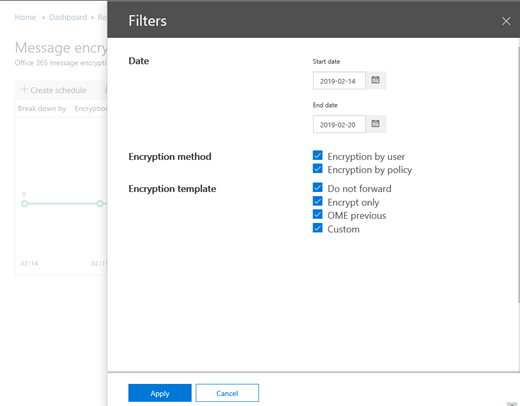
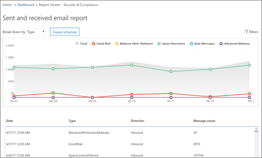

# Просмотр отчетов о безопасности электронной почты в &amp; центре безопасности и соответствия требованиям

В [центре соответствия требованиям безопасности &amp; ](https://protection.office.com) доступны разнообразные отчеты, которые помогут вам понять, как функции безопасности электронной почты, такие как защита от нежелательной почты, защита от вредоносных программ и функции шифрования в Office 365 защищают вашу организацию. Если у вас есть [необходимые разрешения](#what-permissions-are-needed-to-view-these-reports), вы можете просмотреть эти отчеты в центре обеспечения &amp; безопасности, перейдя на **** \> **панель мониторинга**отчетов.
  

  
К отчетам по безопасности электронной почты относятся следующие:
- [Отчет о шифровании](#encryption-report) (NEW!)
- [Отчет о состоянии защиты от угроз](#threat-protection-status-report) 
- [Отчет об обнаружении вредоносных программ](#malware-detections-report) 
- [Отчет о самых вредоносных программах](#top-malware-report)
- [Отчет по основным отправителям и получателям](#top-senders-and-recipients-report)
- [Отчет об обнаружении поддельных поддельных](#spoof-detections-report)
- [Отчет об обнаружении нежелательной почты](#spam-detections-report)
- [Отчет о отправленных и полученных сообщениях электронной почты](#sent-and-received-email-report)
- [Отчет о сообщениях, отчет о пользователях](#user-reported-messages-report)
    
## Отчет о шифровании

(**New!**) В **отчете** о шифровании представлены сведения о зашифрованных сообщениях электронной почты с помощью политик организации или конечных пользователей. Группа безопасности Организации может использовать сведения из этого отчета для определения шаблонов и профилактического применения или настройки политик для конфиденциальных сообщений электронной почты.

Чтобы просмотреть этот отчет, в центре безопасности & соответствия требованиям откройте **отчет**о шифровании **панели мониторинга** \> **отчетов** \> .

 

При первом открытии отчета вы увидите сведения о методах шифрования, используемых в сообщениях электронной почты за прошедшие семь (7) дней. Вы можете изменить диапазон дат и сведения, отображаемые в отчете, щелкнув **фильтры** в правом верхнем углу экрана.

   

Для просмотра данных с помощью шаблона шифрования (или метода) также можно использовать меню " **разделить по** ".

Вы также можете использовать меню **Просмотр данных,** чтобы изменить представление, чтобы увидеть количество зашифрованных сообщений для пяти самых популярных доменов получателей.

Благодаря гибкости нового отчета о шифровании можно просматривать тенденции и выполнять соответствующие действия. Например, если вы видите большое количество сообщений электронной почты, зашифрованных пользователями, может потребоваться добавить политику шифрования для автоматизации шифрования для определенных вариантов использования. (Чтобы получить помощь, ознакомьтесь со статьей [Определение правил для обработки почтового процесса для шифрования сообщений электронной почты в Office 365](define-mail-flow-rules-to-encrypt-email.md).) Другой пример: если у вас есть доступ к шаблонам шифрования, но никто их не использует, вы можете узнать, требуется ли пользователям обучение для этой функции. 

Используйте этот отчет, чтобы группа безопасности и соответствия требованиям Организации отслеживать использование шифрования сообщений и требуются ли дальнейшие действия. Дополнительные сведения о шифровании приведены [в статье шифрование электронной почты в Office 365](email-encryption.md).

## Отчет о состоянии защиты от угроз

Отчет **о состоянии защиты от угроз** — это интеллектуальный отчет, показывающий вредоносную электронную почту, которая была обнаружена и заблокирована службой Exchange Online Protection. Этот отчет полезен для просмотра сообщений электронной почты, определенных в качестве вредоносных программ или фишинговых атак, с течением времени (до 90 дней), а также позволяет администраторам безопасности определять тенденции или определять необходимость внесения изменений в политики.

> [!NOTE]
> Отчет о состоянии защиты от угроз доступен клиентам, у которых есть [Office 365 ATP](office-365-atp.md) или [Exchange Online Protection](eop/exchange-online-protection-eop.md) (EOP); Однако сведения, отображаемые в отчете о состоянии защиты от угроз для клиентов ATP, скорее всего, будут содержать данные, отличные от данных, которые могут видеть пользователи EOP. Например, пользователи EOP могут просматривать сведения о вредоносных программах, обнаруженных в электронной почте, но не могут получить сведения о [вредоносных файлах, обнаруженных в SharePoint Online, OneDrive или Microsoft Teams](atp-for-spo-odb-and-teams.md), с возможностью, характерной для ATP. ([Дополнительные сведения об отчетах ATP](view-reports-for-atp.md).)
  
Чтобы просмотреть этот отчет, в [центре безопасности &amp; и соответствия требованиям](https://protection.office.com)выберите **состояние защиты от угроз**для **панели мониторинга** \> **отчетов** \> .
  

  
Когда вы впервые открываете отчет о состоянии защиты от угроз, в отчете отображаются данные за прошедшие семь дней по умолчанию; Тем не менее, вы можете выбрать **фильтры** и изменить диапазон дат в течение до 90 дней. (Если вы используете пробную подписку, вы можете использовать не более 30 дней данных.)

Этот отчет полезен для просмотра эффективности и воздействия [функций Exchange Online Protection](eop/eop-features.md)в Организации, а также для долгосрочного тенденций. 
  

  
Вы также можете выбрать, следует ли просматривать данные для сообщений электронной почты, определенных как вредоносные, сообщения электронной почты, которые определены как почтовые фишингы, или как содержащие вредоносные программы.
  

  
## Отчет об обнаружении вредоносных программ

Отчет об **обнаружении вредоносных программ** показывает, сколько входящих и исходящих сообщений было обнаружено как содержащее вредоносные программы для вашей организации. 
  
Чтобы просмотреть этот отчет, в [центре безопасности &amp; и соответствия требованиям](https://protection.office.com)перейдите в раздел **отчеты об** \> **обнаружении вредоносных программ**на **панели мониторинга** \> отчетов.
  

  
Как и в случае с другими отчетами, например с [отчетом о состоянии защиты от угроз](#threat-protection-status-report), в отчете по умолчанию отображаются данные за прошедшие семь дней. Тем не менее, вы можете выбрать **фильтры** , чтобы изменить диапазон дат. 
  
## Отчет о самых вредоносных программах

В отчете о **самых вредоносных программах** отображаются различные виды вредоносных программ, обнаруженных в [Exchange Online](eop/eop-features.md). 
  
Чтобы просмотреть этот отчет, в [центре безопасности &amp; и соответствия требованиям](https://protection.office.com)перейдите на страницу **Основные вредоносные программы** **панели мониторинга** \> **отчетов** \> .
  

  
При наведении указателя на сектор на круговой диаграмме отображается название типа вредоносных программ и количество сообщений, обнаруженных при наличии вредоносных программ.
  
Щелкните отчет, чтобы открыть его в новом окне браузера, где можно получить более подробное представление отчета.
  

  
Под диаграммой вы увидите список обнаруженных вредоносных программ и количество сообщений, обнаруженных при наличии вредоносных программ.
  
## Отчет по основным отправителям и получателям

Отчет по верхнему отправителям **и получателям** представляет собой круговую диаграмму, в которой показаны лучшие отправители электронной почты. 
  
Чтобы просмотреть этот отчет, в [центре безопасности &amp; и соответствия требованиям](https://protection.office.com)перейдите на страницу **лучшие отправители и получатели** **панели мониторинга** \> **отчетов** \> .
  

  
При наведении указателя на сектор на круговой диаграмме можно увидеть количество отправленных или полученных сообщений.
  
Щелкните отчет, чтобы открыть его в новом окне браузера, где можно получить более подробное представление отчета.
  
Используйте список **Показать данные** , чтобы выбрать, следует ли просматривать данные для отправителей, получателей, нежелательной почты и получателей вредоносных программ. Вы также можете узнать, кто получил вредоносную программу, обнаруженную [Exchange Online Protection](eop/exchange-online-protection-overview.md). 
  

  
Под диаграммой вы узнаете, кто из первых отправителя или получателей почтовых сообщений, а также количество сообщений, отправленных или полученных в течение определенного периода времени.
  
## Отчет об обнаружении поддельных поддельных

Отчет **** об обнаружении поддельных поддельных сообщений показывает, сколько почтовых сообщений было обнаружено и какие из них были признаны "хорошими" (подделка почты выполнена по законным бизнес-причинам). 
  
Чтобы просмотреть этот отчет, в [центре безопасности &amp; и соответствия требованиям](https://protection.office.com)перейдите в раздел "поддельная **панель мониторинга** \> **** **отчетов** \> ".
  

  
Когда вы наводите указатель мыши на день в диаграмме, вы можете узнать, сколько поступило поддельное сообщение.
  
Щелкните отчет, чтобы открыть его в новом окне браузера, где можно получить более подробное представление отчета. Чтобы узнать больше о защите от спуфинга, ознакомьтесь со статьей [Защита от спуфинга в Office 365](anti-spoofing-protection.md).
  
## Отчет об обнаружении нежелательной почты

В отчете **обнаружения нежелательной почты** отображается весь нежелательный контент, заблокированный Exchange Online. 
  
Чтобы просмотреть этот отчет, в [центре безопасности &amp; и соответствия требованиям](https://protection.office.com)перейдите в раздел **отчеты об** \> обнаружении нежелательной **почты**на **панели мониторинга** \> .
  

  
Когда вы наводите указатель мыши на день в диаграмме, вы можете узнать, сколько элементов было заблокировано в этот день, а также как эти элементы классифицируются по категориям. Например, вы можете узнать, сколько нежелательных сообщений было отфильтровано, и сколько элементов было получено из IP-адреса, заблокированного протоколом Интернета (IP).
  
Щелкните отчет, чтобы открыть его в новом окне браузера, где можно получить более подробное представление отчета.
  

  
Под диаграммой вы увидите список обнаруженных сообщений о нежелательной почте. Выберите элемент, чтобы просмотреть дополнительные сведения, например сведения о том, является ли сообщение нежелательной почтой входящим или исходящим, его ИДЕНТИФИКАТОРом и получателем. Дополнительные сведения о защите от нежелательной почты см в статье [Office 365 защита](anti-spam-protection.md)от нежелательной почты.
  
## Отчет о отправленных и полученных сообщениях электронной почты

Отчет о **отправленных и полученных сообщениях** — это интеллектуальный отчет, в котором отображаются сведения о входящих и исходящих сообщениях электронной почты, в том числе об обнаружении нежелательной почты, вредоносных программах и сообщениях электронной почты, определенных 
  
Чтобы просмотреть этот отчет, в [центре безопасности &amp; и соответствия требованиям](https://protection.office.com)откройте **панель мониторинга** \> **отчетов** \> **Отправленные и полученные сообщения электронной почты**.
  

  
Когда вы наводите указатель мыши на день в диаграмме, вы можете видеть, сколько сообщений было поступило, и как эти сообщения классифицируются по категориям. Например, вы можете узнать, сколько сообщений было определено как содержащие вредоносные программы, и сколько было определено как спам.
  
Щелкните отчет, чтобы открыть его в новом окне браузера, где можно получить более подробное представление отчета.
  
Для просмотра сведений по типу или по направлению (входящее и исходящее) можно использовать список **разбивки по** списку. 
  

  
Под диаграммой вы увидите список категорий электронной почты, например **гудмаил**, **спамконтентфилтеред**и т. д. Выберите категорию, чтобы просмотреть дополнительные сведения, такие как действия, предпринятые для вредоносных программ, а также сведения о том, является ли электронная почта входящей или исходящей.
  

Дополнительные сведения об аналитике электронной почты см [в статье Управление почтовыми сообщениями в Office 365](mail-flow-intelligence-in-office-365.md).
  
## Отчет о сообщениях, отчет о пользователях

Отчет **** о сообщениях в отчетах о пользователях содержит сведения о сообщениях электронной почты, которые пользователи сообщили как нежелательные, фишинговые попытки или хорошие сообщения с помощью [надстройки Report Message](enable-the-report-message-add-in.md).
  
Для каждого сообщения доступны подробные сведения, в том числе причина доставки, такие как исключение политики нежелательной почты или правило обработки почты, настроенное для Организации. Чтобы просмотреть сведения, выберите элемент в списке пользователь — отчеты, а затем просмотрите сведения на вкладках **Сводка** и **сведения** . 
  

  
Чтобы просмотреть этот отчет, в [центре безопасности &amp; и соответствия требованиям](https://protection.office.com)выполните одно из следующих действий.
  
- Перейдите к сообщению, **сообщенному пользователями** **панели** \> **управления** \> угрозами.
    
- Перейдите к разделу **Управление** \> угрозами **Обзор** \> **сообщений, отправленных пользователями**.
    

  
> [!IMPORTANT]
> Чтобы отчет о сообщениях, отправленных пользователями, работал правильно, **необходимо включить ведение журнала аудита** для среды Office 365. Это обычно делается для пользователей, которым назначена роль "журналы аудита" в Exchange Online. Дополнительную информацию можно узнать [в статье Включение и отключение поиска в журнале аудита Office 365](turn-audit-log-search-on-or-off.md). 
  
## Какие разрешения необходимы для просмотра отчетов?

Для просмотра и использования отчетов, описанных в этой статье, **необходимо назначить соответствующую роль для центра безопасности &amp; и центра администрирования Exchange**.

- Для центра соответствия &amp; требованиям безопасности необходимо назначить одну из следующих ролей:
    - Управление организацией
    - Администратор безопасности (это можно назначить в центре администрирования Azure Active Directory ([https://aad.portal.azure.com](https://aad.portal.azure.com)).
    - Средство чтения безопасности

- Для Exchange Online необходимо назначить одну из следующих ролей в центре администрирования Exchange ([https://outlook.office365.com/ecp](https://outlook.office365.com/ecp)) или с помощью командлетов PowerShell (см. [Exchange Online PowerShell](https://docs.microsoft.com/powershell/exchange/exchange-online/exchange-online-powershell?view=exchange-ps)):
    - Управление организацией
    - Управление организацией с правами только на просмотр
    - Роль получателей с правами только на просмотр
    - Управление соответствием требованиям

Чтобы узнать больше, ознакомьтесь со следующими материалами:

- [Permissions in the Office 365 Security &amp; Compliance Center](permissions-in-the-security-and-compliance-center.md)

- [Разрешения компонентов в Exchange Online](https://docs.microsoft.com/exchange/permissions-exo/feature-permissions)
   
   
## Что делать, если в отчетах данные не отображаются?

Если вы не видите данные в отчетах, дважды проверьте правильность настройки политик. Чтобы узнать больше, ознакомьтесь [со статьей защита от угроз в Office 365](protect-against-threats.md).
  
## Статьи по теме

[Защита от спама электронной почты в Office 365](anti-spam-protection.md)
  
[Отчеты и аналитика в центре безопасности &amp; и соответствия требованиям Office 365](reports-and-insights-in-security-and-compliance.md)
  
[Создание расписания для отчета в центре безопасности &amp; и соответствия требованиям](create-a-schedule-for-a-report.md)
  
[Настройка и загрузка настраиваемого отчета в центре безопасности &amp; и соответствия требованиям](set-up-and-download-a-custom-report.md)
  

