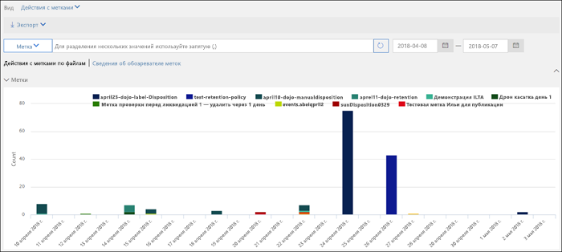
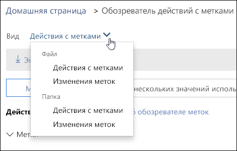
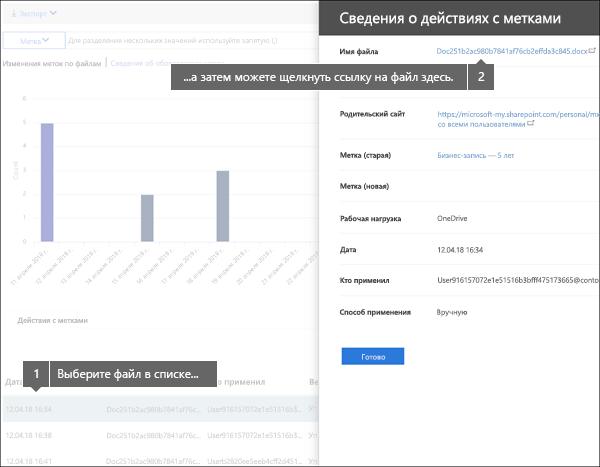
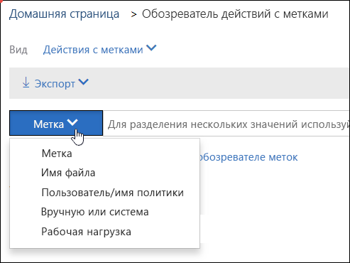

# Просмотр действий с метками для документовView label activity for documents

После создания меток вам нужно убедиться, что они надлежащим образом применяются к контенту. При помощи обозревателя действий с метками в Центре безопасности и соответствия требованиям Office 365 вы можете быстро искать и просматривать весь контент в SharePoint и OneDrive для бизнеса за последние 30 дней. Эти данные обновляются в реальном времени, давая вам хорошее представление о том, что происходит в вашем клиенте.After you create your labels, you'll want to verify that they're being applied to content as you intended. With the Label Activity Explorer in the Office 365 Security &amp; Compliance Center, you can quickly search and view label activity for all content across SharePoint and OneDrive for Business over the past 30 days. This is real-time data that gives you a clear view into what's happening in your tenant.
  
Например, при помощи обозревателя действий с метками вы можете:For example, with the Label Activity Explorer, you can:
  
- Просматривать, сколько раз каждая метка применялась в тот или иной день (до 30 дней).View how many times each label was applied on each day (up to 30 days).
    
- Узнавать, кто и когда помечал какие файлы, и получать ссылки на сайты, где они хранятся.See who labeled exactly which file on which date, along with a link to the site where that file resides.
    
- Определять, метки каких файлов были изменены или удалены, просматривать старые и новые метки, а также узнавать, кто внес изменение.View which files had labels changed or removed, what the old and new labels are, and who made the change.
    
- Фильтровать данные, чтобы просматривать действия с метками для определенных меток, файлов или пользователей. Вы также можете фильтровать действия с метками по расположению (SharePoint или OneDrive для бизнеса) и способу применения метки (вручную или автоматически).Filter the data to see all the label activity for a specific label, file, or user. You can also filter label activity by location (SharePoint or OneDrive for Business) and whether the label was applied manually or auto-applied.
    
- Просматривать действия с метками для папок, а также отдельных документов. В скором времени появится возможность просматривать количество файлов в той или иной папке, помеченных в результате применения метки к этой папке.View label activity for folders as well as individual documents. Coming soon is the ability to show how many files inside that folder got labeled as a result of the folder getting labeled.
    
Обозреватель действий с метками можно открыть из Центра безопасности и соответствия требованиям, выбрав пункты **Управление данными** > **Обозреватель действий с метками**.You can find the Label Activity Explorer in the Security &amp; Compliance Center > **Data governance** > **Label Activity Explorer**.
  
Обратите внимание, что для использования обозревателя действий с метками необходима подписка на Office 365 корпоративный E5.Note that the Label Activity Explorer requires an Office 365 Enterprise E5 subscription.
  

  
## Просмотр действий с метками для файлов и папокView label activities for files or folders

В верхней части обозревателя действий с метками можно выбрать просмотр действий для файлов или папок. Обратите внимание, что под действиями с папкой подразумеваются операции только с самой папкой, а не с хранящимися в ней файлами.At the top of the Label Activity Explorer, you can choose whether to view activities for files or folders. Note that folder activity includes only the folder itself, not the files inside the folder.
  
Вам может потребоваться просматривать действия для папок, потому что когда вы помечаете папку, всем файлам в этой папке также назначается эта метка (кроме тех файлов, к которым была явно применена метка). Следовательно, пометка папок может повлиять на значительное количество файлов. Дополнительные сведения см. в разделе [Применение метки хранения по умолчанию ко всему контенту в библиотеке SharePoint, папке или набору документов](labels.md#applying-a-default-retention-label-to-all-content-in-a-sharepoint-library-folder-or-document-set).You might want to see label activity for folders because if you label a folder, all files inside that folder also get that label (except for files that have had a label applied explicitly to them). Therefore, labeling folders might affect a significant number of files. For more information, see [Applying a default retention label to all content in a SharePoint library, folder, or document set](labels.md#applying-a-default-retention-label-to-all-content-in-a-sharepoint-library-folder-or-document-set).
  

  
### Действия с меткамиLabel activities

 **Действия с метками** включают все операции: **добавление**, **удаление** и **изменение** метки. С помощью этого представления вы можете узнать, к скольким файлам в день применяется та или иная метка.**Label activities** includes all label actions: **adding**, **removing**, or **changing** a label. You can use this view to get a comprehensive look at how many files each label's been applied to per day. 
  
### Изменения метокLabel changes

 Представление **Изменения меток** включает потенциально рискованные действия — **удаление** и **изменение** меток. С помощью этого представления вы можете быстро ознакомиться с рискованными действиями и узнать, какие пользователи их выполняли. Вы можете выбрать файл в списке действий под диаграммой, а затем перейти по ссылке на этот файл в области сведений справа.**Label changes** includes the potentially risky actions of **removing** or **changing** a label. You can use this view to quickly see such risky actions and the user who performed them. In the activity list below the chart, you can select a file, and then click a link to that file in the details pane on the right. 
  

  
## Фильтрация действий с меткамиFilter label activity

Вы можете быстро отфильтровать данные, чтобы просмотреть действия с метками для определенных метки, файла или пользователя. Вы также можете фильтровать действия с метками по расположению (SharePoint или OneDrive для бизнеса) и способу применения метки (вручную или автоматически).You can quickly filter the data to see all the label activity for a specific label, file, or user. You can also filter label activity by location (SharePoint or OneDrive for Business) and whether the label was applied manually or auto-applied.
  

  

