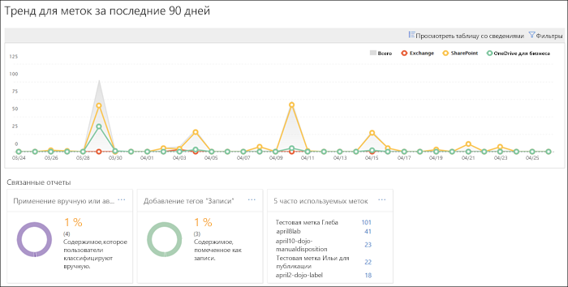
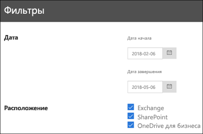

# Просмотр отчетов для управления даннымиView the data governance reports

После создания меток нужно проверить, применяются ли они к содержимому так, как задумано. Это можно быстро сделать в Центре безопасности и соответствия требованиям Office 365 с помощью таких отчетов для управления данными:After you create your labels, you'll want to verify that they're being applied to content as you intended. With the data governance reports in the Office 365 Security &amp; Compliance Center, you can quickly view:
  
- **5 часто используемых меток**. В этом отчете показан счетчик для пяти часто используемых меток, применяемых к содержимому. Откройте этот отчет, чтобы просмотреть список всех меток, которые недавно применялись к содержимому. Вы можете просмотреть счетчик, действия хранения, расположение, способ применения, тип ликвидации для каждой метки, а также то, является ли она записью.**Top 5 labels** This report shows the count of the top 5 labels that have been applied to content. Click this report to view a list of all labels that have been recently applied to content. You can see each label's count, location, how it was applied, its retention actions, whether it's a record, and its disposition type. 
    
- **Применение автоматически или вручную**. В этом отчете показан счетчик для всего содержимого, к которому были применены метки вручную или автоматически, а также процентное соотношение содержимого, к которому были применены метки вручную, и содержимого, к которому были применены метки автоматически.**Manual vs Auto apply** This report shows the count of all content that's been labeled manually or automatically, and the percentage of content that's been labeled manually vs automatically. 
    
- **Расстановка тегов для записей**. В этом отчете показан счетчик для всего содержимого, отмеченного как запись или не запись, а также процентное соотношение содержимого, отмеченного как запись, и содержимого, отмеченного как не запись.**Records tagging** This report shows the count of all content that's been tagged as a record or non-record, and the percentage of content that's been tagged as a record vs. non-record. 
    
- **Тренд для меток за последние 90 дней**. В этом отчете показаны счетчик и расположение для всех меток, которые были применены за последние 90 дней.**Labels trend over the past 90 days** This report shows the count and location of all labels that have been applied in the last 90 days. 
    
Во всех этих отчетах показано содержимое из Exchange, SharePoint и OneDrive для бизнеса, к которому были применены метки.All these reports show labeled content from Exchange, SharePoint, and OneDrive for Business.
  
Вы найдете эти отчеты, открыв Центр безопасности и соответствия требованиям и выбрав **Управление данными** \> **Информационная панель**.You can find these reports in the Security &amp; Compliance Center \> **Data Governance** \> **Dashboard**.
  

  
Отчеты для управления данными можно фильтровать по дате (до 90 дней) и расположению (Exchange, SharePoint и OneDrive для бизнеса). Самые новые данные появляются в отчетах в течение 24 часов.You can filter the data governance reports by date (up to 90 days) and location (Exchange, SharePoint, and OneDrive for Business). The most recent data can take up to 24 hours to appear in the reports.
  

  

