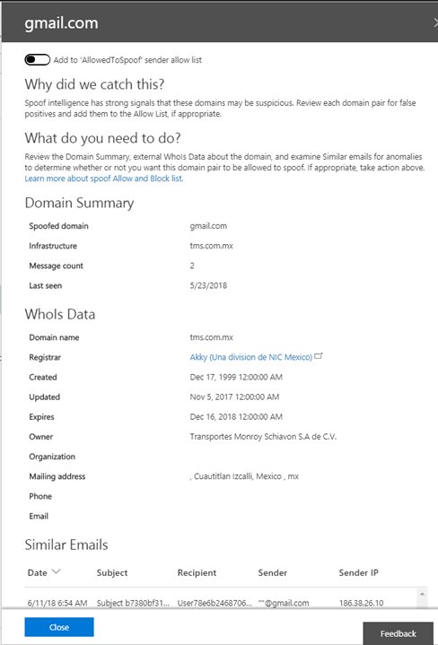

# Пошаговое руководство: аналитика подделкиWalkthrough: spoof intelligence insight

С помощью анализа анализа подделки можно быстро определить, какие отправители подлиннее отправляют вам сообщения, не прошедшие проверку подлинности.By using the Spoof Intelligence insight, you can quickly determine which senders are legitimately sending you unauthenticated email. Если вы разрешаете отправлять поддельные сообщения, вы можете снизить риск возникновения любых ложных срабатываний, отправляемых пользователям.By permitting them to send spoofed messages, you can reduce the risk of any false positives going to your users.
  
Кроме того, можно использовать монитор логики подделки и управлять разрешенными парами доменов, чтобы обеспечить дополнительный уровень безопасности и предотвратить поступление небезопасных сообщений в организацию.In addition, you can also use Spoof Intelligence monitor and manage permitted domain-pairs to provide an additional layer of security and prevent unsafe messages from arriving in your organization.
  
Вы можете использовать сведения о подделке в центре безопасности &amp; , если ваша рабочая или учебная учетная запись была предоставлена пользователям Office 365 глобальный администратор, администратор безопасности или средство чтения безопасности.You can use the spoof intelligence insight in the Security &amp; Compliance Center if your work or school account has been given Office 365 global administrator, security administrator, or security reader permissions. Дополнительные сведения см. [в разделе разрешения в центре безопасности &amp; и соответствия требованиям Office 365](permissions-in-the-security-and-compliance-center.md).For more information, see [Permissions in the Office 365 Security &amp; Compliance Center](permissions-in-the-security-and-compliance-center.md).
  
Если вы не знакомы с [отчетами и аналитическими сведениями в центре безопасности &amp; и соответствия требованиям Office 365](reports-and-insights-in-security-and-compliance.md), то можете понять, как легко переходить с панели мониторинга на подробные и рекомендуемые действия.If you're new to [reports and insights in the Office 365 Security &amp; Compliance Center](reports-and-insights-in-security-and-compliance.md), it might help to see how you can easily navigate from a dashboard to an insight and recommended actions.
  
В центре безопасности &amp; и соответствия требованиям вы можете просмотреть сведения о подделке.You can view the spoof intelligence insight from more than one dashboard in the Security &amp; Compliance Center. Независимо от того, какая панель мониторинга отображается, сведения о ней представлены одинаково и позволяют быстро выполнять те же задачи.Regardless of which dashboard you're looking at, the insight provides the same details and allows you to quickly perform the same tasks.
  
Это одно из нескольких пошаговых руководств для центра &amp; безопасности и соответствия требованиям.This is one of several walkthroughs for the Security &amp; Compliance Center. Сведения о том, как переходить по отчетам и аналитическим сведениям, можно найти в пошаговых руководствах раздела "связанные темы".To about navigating reports and insights, see the walkthroughs in the Related topics section.
  
## Получение сведений о подделке в центре безопасности &amp; и соответствия требованиямGetting to the spoof intelligence insight in the Security &amp; Compliance Center

1. Чтобы приступить к работе, вам потребуется [Перейти в центр &amp; безопасности и соответствия требованиям](go-to-the-securitycompliance-center.md).To get started, you'll need [go to the Security &amp; Compliance Center](go-to-the-securitycompliance-center.md).
    
2. В центре безопасности &amp; и соответствия требованиям перейдите на **панель мониторинга** **управления** \> угрозами.In the Security &amp; Compliance Center, go to **Threat Management** \> **Dashboard.**
    
3. В строке **аналитических сведений** найдите аналитику подделки.In the **Insights** row, look for the spoof intelligence insight. Если вы включили логику "анализ поддельных поддельных поддельных поддельных сведений", это поддельный **домен, который не прошел проверку подлинности за**If you have enabled spoof intelligence, then the insight is entitled **Spoofed domains that failed authentication of the past 30 days**. Если вы не включили защиту от поддельных поддельных поддельных поддельных поддельных поддельных поддельных сведений, то вам будет предложено сделать это \*\*\*\*If you haven't enabled spoof protection, then the insight will prompt you to do so by using the title **Enable Spoof Protection**. 
    
## Сведения об аналитической панели мониторингаAbout the insight on the dashboard

В панели мониторинга отображается информация, подобная приведенной ниже.The insight on the dashboard shows you information like this.
  

  
Эта аналитика имеет два режима:This insight has two modes:
  
 **Режим анализа**.**Insight mode**. Если у вас включена политика подмены, то в этой информации показывается, сколько почтовых ящиков было затронуты нашими функциями анализа подделки за прошедшие 30 дней.If you have any spoof policy enabled, then the insight shows you how many mails were impacted by our spoof intelligence capabilities over the past 30 days. 
  
 **Режим "что если**".**What if mode**. Если политика подмены не включена, то в разделе сведения о количестве почтовых ящиков, на \*\* которые повлияла функция анализа подделки за прошедшие 30 дней.If you do not have any spoof policy enabled, then the insight shows you how many mails  *would*  have been impacted by our spoof intelligence capabilities over the past 30 days. 
  
В обоих случаях поддельные домены, отображаемые в разделе Insights, делятся на две категории; подозрительные пары доменов и пары неподозрительных доменов.Either way, the spoofed domains displayed in the insight are separated into two categories; suspicious domain pairs and non-suspicious domain pairs. Эти категории далее делятся на три разных сегмента для просмотра.These categories are further subdivided into three different buckets for you to review. 
  
*Пары домена* это сочетание адреса "от:" и инфраструктуры отправки.A  *domain pair*  is a combination of the "From:" address and the sending infrastructure. 
  
- Адрес "от" — это адрес, отображаемый почтовым приложением как адрес отправителя.The "From" address is the address displayed as the From address by your mail application. Он отображен в почтовом приложении как адрес отправителя.This address identifies the author of the email. Этот адрес указывает автора сообщения, вернее, почтовый ящик человека или систему, где оно было создано.That is, the mailbox of the person or system responsible for writing the message. Он иногда зовется адресом 5322.From.This is sometimes called the 5322.From address.
    
- Отправляющей инфраструктурой или отправителем является организационным доменом записи PTR для отправляющего IP-адреса.The sending infrastructure, or sender, is the organizational domain of the PTR record of the sending IP address. Если у отправляющего IP-адреса нет записи PTR, отправитель идентифицируется с помощью отправляющего IP-адреса с маской подсети 255.255.255.0 в нотации CIDR (/24).If the sending IP address has no PTR record, then the sender is identified by the sending IP with the 255.255.255.0 subnet mask in CIDR notation (/24). Например, если IP-адрес 192.168.100.100, то полный IP-адрес отправителя — 192.168.100.100/24.For example, if the IP address is 192.168.100.100 then the complete IP address of the sender is 192.168.100.100/24.
    
 К **подозрительным парам доменов** относятся:**Suspicious domain pairs** include: 
  
- **Подделка высокого уровня доверия**.**High-confidence spoof**. Office 365 получил сильные сигналы о том, что эти домены являются подозрительными, в зависимости от исторических шаблонов отправки и оценки репутации доменов.Office 365 received strong signals that these domains are suspicious, based on the historical sending patterns and the reputation score of the domains. Office 365 строго надежнее, так как домены поддаются подмене, а сообщения, отправляемые из этих доменов, считаются менее вероятными.Office 365 is highly confident that the domains are spoofing and that messages sent from these domains are less likely to be legitimate. 
    
- **Умеренное подмена**.**Moderate confidence spoof**. Office 365 получил умеренные сигналы о том, что эти домены являются подозрительными, на основе прошлых шаблонов отправки и оценки репутации доменов.Office 365 received moderate signals that these domains are suspicious, based on historical sending patterns and the reputation score of the domains. В Office 365 средний уровень уверенности в том, что домены являются подменами и сообщения, отправляемые из этих доменов, являются законными.Office 365 is moderately confident that the domains are spoofing and that messages sent from these domains are legitimate. Этот сегмент имеет большую вероятность того, что он содержит ложные срабатывания (кадров в процентах), чем сегмент подделки с высоким уровнем доверия.This bucket has a greater chance of containing false positives (FPs) than the high-confidence spoof bucket. 
    
 **Неподозрительные пары доменов** включают в себя **Аварийное подделку**.**Non-suspicious domain pairs** include **rescued spoof**. Аварийное подделка — домены, не прошедшие проверку подлинности ( [SPF](https://docs.microsoft.com/office365/SecurityCompliance/how-office-365-uses-spf-to-prevent-spoofing), [DKIM](https://docs.microsoft.com/office365/SecurityCompliance/use-dkim-to-validate-outbound-email), [DMARC](https://docs.microsoft.com/office365/SecurityCompliance/use-dmarc-to-validate-email)), но прошедшие проверку расширенной проверки подлинности.Rescued spoof are domains that have failed the explicit authentication checks ( [SPF](https://docs.microsoft.com/office365/SecurityCompliance/how-office-365-uses-spf-to-prevent-spoofing), [DKIM](https://docs.microsoft.com/office365/SecurityCompliance/use-dkim-to-validate-outbound-email), [DMARC](https://docs.microsoft.com/office365/SecurityCompliance/use-dmarc-to-validate-email)) but passed our extended authentication checks. В результате Office 365 проводил сообщение от вашего имени и не предприняло никаких действий по борьбе с подменой почты.As a result of this, Office 365 rescued the mail on your behalf and no anti-spoofing action was taken on the mail. 
  
## Просмотр подробных сведений о подозрительных парах доменов из аналитической аналитики подделкиView detailed information about suspicious domain pairs from the spoof intelligence insight

1. В поддельной информации выберите любую из пар доменов (высокая, средняя или копия).On the spoof intelligence insight, click any of the domain pairs (high, moderate, or rescued).
  
Отобразится страница "сведения о **подделке** ", в которой отображается список отправителей, которые отправляют в организацию непроверенные сообщения.The **Spoof Intelligence Insight** page appears showing you a list of senders that are sending unauthenticated mail into your organization. Сведения на этой странице помогут определить, авторизованы ли подложные сообщения или нет или требуется предпринять дальнейшие действия.The information on this page helps you determine whether spoofed messages are authorized or not or if you need to take further action. Вы можете отсортировать информацию по количеству сообщений, дате и времени последнего обнаружения подделки и т. д.You can sort the information by message count, the date the spoof was last detected, and more. (Например, "количество сообщений" или " **Последнее**Просмотр" (например, " **количество сообщений** ").(Click column headings, such as **Message count** or **Last seen**, for example.) 
    
2. Выберите элемент в таблице, чтобы открыть область сведений, содержащую обширные сведения об этой учетной записи, в том числе почему мы перехватили это, что нужно сделать, сводка по домену, данные WhoIs о отправителе и Похожие сообщения электронной почты, которые мы видели у того же отправителя.Select an item in the table to open a details pane that contains rich information about the domain pair, including why we caught this, what you need to do, a domain summary, WhoIs data about the sender, and similar emails we have seen in your tenant from the same sender. Отсюда вы можете добавить или удалить комбинацию домена из списка надежных отправителей **алловедтоспуф** .From here, you can also choose to add or remove the domain pair from the **AllowedToSpoof** safe sender list. 
  

  
## Добавление или удаление домена из списка надежных отправителей АлловедтоспуфAdd or remove a domain from the AllowedToSpoof safe sender list

Вы добавляете или удаляете домен из списка надежных отправителей Алловедтоспуф, а затем просматриваете доменную информацию в области сведений в области сведений о подделке.You add or remove a domain from the AllowedToSpoof safe sender list while reviewing the domain pair in the details pane of the spoof intelligence insight. Просто установите переключатель соответствующим образом.Simply set the toggle accordingly.
  
Это приводит к изменению пары доменных комбинаций поддельного домена и отправляющей инфраструктуры и не обеспечивает покрытие для всего поддельного домена или инфраструктуры отправки в изоляции.This modifies the unique domain pair combination of the spoofed domain and the sending infrastructure and does not provide coverage for the entire spoofed domain or the sending infrastructure in isolation. Например, если добавить следующую доменную связь в список разрешенных отправителей "Алловедтоспуф": поддельный *домен* "Gmail.com" и *отправляющий инфраструктуру* "TMS *. MX.com",* то подменить только почтовые сообщения из этой доменной области.For example, if you add the following domain pair to the 'AllowedToSpoof' sender allow list:  *Spoofed Domain*  "gmail.com" and  *Sending Infrastructure*  "tms  *.mx.com",*  then only mail from that domain pair will be allowed to spoof. Другие отправители, пытающиеся подделывать "gmail.com", и другие домены, которые "tms.mx.com" пытаются подменить, по-прежнему будут защищаться службой подделки.Other senders attempting to spoof "gmail.com", and other domains that "tms.mx.com" attempt to spoof will continue to be protected by spoof intelligence. 
  
## Статьи по темеRelated topics

[Дополнительные сведения об аналитике спуфингаLearn more about spoof intelligence](learn-about-spoof-intelligence.md)
  
[Защита от спуфинга в Office 365Anti-spoofing protection in Office 365](anti-spoofing-protection.md)
  
[Пошаговое руководство. Из панели мониторинга к аналитикеWalkthrough - From a dashboard to an insight](from-a-dashboard-to-an-insight.md)
  
[Пошаговое руководство. Из подробного отчета к аналитикеWalkthrough - From a detailed report to an insight](from-a-detailed-report-to-an-insight.md)
  
[Пошаговое руководство. Из аналитики к подробному отчетуWalkthrough - From an insight to a detailed report](from-an-insight-to-a-detailed-report.md)
  

