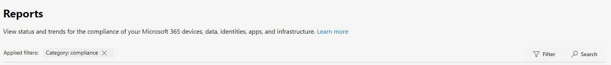

# Новые возможности центра соответствия требованиям Microsoft 365What's new in the Microsoft 365 compliance center

Мы постоянно добавляем новые функции в [центр соответствия требованиям Microsoft 365](microsoft-365-compliance-center.md), устранять проблемы, которые мы будем изучать, и вносить изменения в соответствии с вашими отзывами.We're continuously adding new features to the [Microsoft 365 compliance center](microsoft-365-compliance-center.md), fixing issues we learn about, and making changes based on your feedback. Ознакомьтесь со статьей ниже, чтобы узнать, что сейчас доступно.Take a look below to see what's available for you today. Некоторые функции получаются на разных скоростях для наших клиентов.Some features get rolled out at different speeds to our customers. Если вы еще не видите компонент, попробуйте добавить себя в [целевой выпуск](https://docs.microsoft.com/office365/admin/manage/release-options-in-office-365).If you aren't seeing a feature yet, try adding yourself to [targeted release](https://docs.microsoft.com/office365/admin/manage/release-options-in-office-365).

> [!TIP]
> Хотите узнать, что происходит в других центрах администрирования?Interested in what's going on in other admin centers? Ознакомьтесь со следующими статьями:Check out these articles: [Новые возможности центра администрирования Microsoft 365What's new in the Microsoft 365 admin center](https://docs.microsoft.com/office365/admin/whats-new-in-preview?view=o365-worldwide) [Новые возможности в центре администрирования SharePointWhat's new in the SharePoint admin center](https://docs.microsoft.com/sharepoint/what-s-new-in-admin-center)

## 2019 июляJuly 2019

### Новые роли администраторовNew admin roles

Мы выпускали две новые роли администратора для управления безопасностью и соответствием требованиям в Организации. Расскажите всем друзьям.We released two new admin roles to help manage security and compliance in your org. Tell all your friends.

- **Администратор данных соответствия требованиям**. Пользователи с этой ролью имеют разрешения на защиту и отслеживание данных в центре соответствия требованиям Microsoft 365, центре администрирования Microsoft 365 и Azure.**Compliance data admin**. Users with this role have permissions to protect and track data in the Microsoft 365 compliance center, Microsoft 365 admin center, and Azure. Кроме того, они могут управлять всеми разделом администрирования Exchange, диспетчером соответствия требованиям, Teams & центре администрирования Skype для бизнеса и создавать билеты поддержки для Azure и Microsoft 365.They can also manage everything the Exchange admin center, Compliance Manager, Teams & Skype for Business admin center and create support tickets for Azure and Microsoft 365.
- **Оператор безопасности**.**Security operator**. Пользователи с этой ролью могут управлять оповещениями и иметь глобальный доступ только для чтения к функциям, связанным с безопасностью, включая все в центре безопасности Microsoft 365, Azure Active Directory, защиту удостоверений, управление привилегированными удостоверениями и Office 365 Центр безопасности & соответствия требованиям.Users with this role can manage alerts and have global read-only access to security-related features, including everything in the Microsoft 365 security center, Azure Active Directory, Identity Protection, Privileged Identity Management and Office 365 Security & Compliance Center.

[Дополнительные сведения об этих роляхLearn more about these roles](https://docs.microsoft.com/office365/securitycompliance/permissions-microsoft-365-compliance-security)

### Поиск и фильтрация для отчетовSearch and filtering for reports

Прокручивать изображения в море отчетов, чтобы найти нужные.No more scrolling through a sea of reports to find the ones you want. Теперь вы можете искать отчеты (на основе их названий) и фильтровать по категориям, например "метки" и "соответствие", а также источники, такие как "Office 365" и "Microsoft Cloud App Security".You can now search for reports (based on their titles) and filter on categories like ‘Labels’ and ‘Compliance’ and sources like ‘Office 365’ and 'Microsoft Cloud App Security’.

### Партнеры: права администратора от имени (АОБО)Partners: Admin on behalf of (AOBO) permissions

Хорошие новости для сертифицированных партнеров Майкрософт.Good news for Microsoft Certified Partners. Партнеры с правами администратора от имени (АОБО) теперь могут получить доступ к центрам безопасности и соответствия Microsoft 365, добавив домен пользователя в URL-адрес.Partners with Admin On Behalf Of (AOBO) permissions can now access the Microsoft 365 security and compliance centers by adding the customer’s domain to the URL. Пример: `https://security.microsoft.com/contoso.com`.For example: `https://security.microsoft.com/contoso.com`.

### Содержимое справкиHelp content

Вытяните кресло из кресла, Возьмите чашку кофе и позвольте нам получить последние документы о соответствии.Pull up a chair, grab a cup of coffee, and let our latest compliance docs sweep you away.

**Advanced eDiscovery****Advanced eDiscovery**
- [Обзор бесед в Advanced eDiscovery](compliance20/conversation-review-sets.md) Впервые[Review conversations in Advanced eDiscovery](compliance20/conversation-review-sets.md) (New)
- [Устранение неполадок AzCopy в Advanced eDiscoveryTroubleshoot AzCopy in Advanced eDiscovery](compliance20/troubleshooting-azcopy.md)
- [Загрузка не относящихся к Office 365 данных в набор для проверкиLoad non-Office 365 data into a review set](compliance20/load-non-office365-data.md)
- [Исправление ошибок при обработке данныхError remediation when processing data](compliance20/error-remediation.md)

**Архивация сторонних данных****Archiving 3rd-party data**
- [Настройка соединителя для архивации данных мгновенных Bloomberg в Office 365Set up a connector to archive Instant Bloomberg data in Office 365](archive-instant-bloomberg-data.md)

**Аудит****Auditing**
- [Аудит общего доступа с помощью журнала аудита Office 365Use sharing auditing in the Office 365 audit log](use-sharing-auditing.md)
- [Справочник по API действий управления Office 365Office 365 Management Activity API reference](https://docs.microsoft.com/office/office-365-management-api/office-365-management-activity-api-reference)
- [Устранение неполадок, связанных с API действий управления Office 365Troubleshooting the Office 365 Management Activity API](https://docs.microsoft.com/office/office-365-management-api/troubleshooting-the-office-365-management-activity-api)
- [Поиск в журнале аудита в центре безопасности & соответствия требованиямSearch the audit log in the Security & Compliance Center](search-the-audit-log-in-security-and-compliance.md)

**Шифрование****Encryption**
- [Сведения об устаревших продуктах для службы шифрования сообщений Office 365Legacy information for Office 365 Message Encryption](legacy-information-for-message-encryption.md)

**Уровней****Classification**
- [Создание пользовательских типов конфиденциальной информации с классификацией на основе точного совпадения данныхCreate custom sensitive information types with Exact Data Match based classification](create-custom-sensitive-information-types-with-exact-data-match-based-classification.md)

**Управление данными****Data governance**
- [Обзор политик храненияOverview of retention policies](retention-policies.md)

**Контроля****Supervision**
- [Политики контроля в Office 365Supervision policies in Office 365](supervision-policies.md)