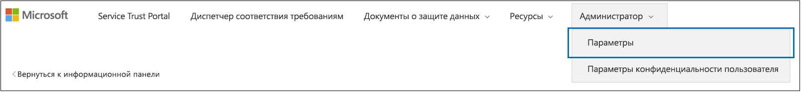

# <a name="work-with-microsoft-compliance-manager-preview"></a><span data-ttu-id="40f86-104">Работать с диспетчером соответствия требованиям Майкрософт (Предварительная версия)</span><span class="sxs-lookup"><span data-stu-id="40f86-104">Work with Microsoft Compliance Manager (Preview)</span></span>

> [!IMPORTANT]
> <span data-ttu-id="40f86-105">Диспетчер соответствия требованиям (Microsoft) — это средство панели мониторинга и управления, которое предоставляет сводку по защите данных и требованиям к статуре, а также рекомендации по улучшению защиты и соответствия данных.</span><span class="sxs-lookup"><span data-stu-id="40f86-105">Microsoft Compliance Manager is a dashboard and management tool that provides a summary of your data protection and compliance stature and recommendations to improve data protection and compliance.</span></span> <span data-ttu-id="40f86-106">Действия клиентов, предоставленные в диспетчере соответствия требованиям, являются рекомендациями; в Организации необходимо оценить эффективность этих рекомендаций в соответствующей нормативной среде перед реализацией.</span><span class="sxs-lookup"><span data-stu-id="40f86-106">The customer actions provided in Compliance Manager are recommendations; it is up to your organization to evaluate the effectiveness of these recommendations in their respective regulatory environment prior to implementation.</span></span> <span data-ttu-id="40f86-107">Рекомендации, найденные в диспетчере соответствия требованиям, не интерпретируются как гарантию соответствия требованиям.</span><span class="sxs-lookup"><span data-stu-id="40f86-107">Recommendations found in Compliance Manager should not be interpreted as a guarantee of compliance.</span></span>

## <a name="access-compliance-manager"></a><span data-ttu-id="40f86-108">Управление соответствием требованиям</span><span class="sxs-lookup"><span data-stu-id="40f86-108">Access Compliance Manager</span></span>

<span data-ttu-id="40f86-p103">Перейти к диспетчеру соответствия требованиям можно с портала Service Trust Portal. Диспетчер соответствия требованиям доступен любому пользователю с учетной записью Майкрософт или организационной учетной записью Azure Active Directory.</span><span class="sxs-lookup"><span data-stu-id="40f86-p103">You access Compliance Manager from the Service Trust Portal. Anyone with a Microsoft account or Azure Active Directory organizational account can access Compliance Manager.</span></span>
  
1. <span data-ttu-id="40f86-111">Перейдите по ссылке [https://servicetrust.microsoft.com](https://servicetrust.microsoft.com/).</span><span class="sxs-lookup"><span data-stu-id="40f86-111">Go to [https://servicetrust.microsoft.com](https://servicetrust.microsoft.com/).</span></span>

2. <span data-ttu-id="40f86-112">Войдите с помощью учетной записи службы Майкрософт.</span><span class="sxs-lookup"><span data-stu-id="40f86-112">Sign in with your Microsoft service account.</span></span> <span data-ttu-id="40f86-113">Это ваша учетная запись пользователя Office 365, Microsoft 365 или Azure Active Directory (Azure AD).</span><span class="sxs-lookup"><span data-stu-id="40f86-113">This is your Office 365, Microsoft 365, or Azure Active Directory (Azure AD) user account.</span></span>

3. <span data-ttu-id="40f86-114">На портале доверия службы выберите **Диспетчер соответствия требованиям**.</span><span class="sxs-lookup"><span data-stu-id="40f86-114">In the Service Trust Portal, select **Compliance Manager**.</span></span> <span data-ttu-id="40f86-115">Это предварительная версия диспетчера соответствия требованиям.</span><span class="sxs-lookup"><span data-stu-id="40f86-115">This is the preview version of Compliance Manager.</span></span> <span data-ttu-id="40f86-116">**Диспетчер соответствия требованиям (классическое)** — это ссылка на предыдущую версию диспетчера соответствия требованиям.</span><span class="sxs-lookup"><span data-stu-id="40f86-116">**Compliance Manager (Classic)** is the link to the previous version of Compliance Manager.</span></span>

4. <span data-ttu-id="40f86-117">Когда отобразится соглашение о неразглашении, прочтите его и нажмите кнопку **согласиться** , чтобы продолжить.</span><span class="sxs-lookup"><span data-stu-id="40f86-117">When the Non-Disclosure Agreement is displayed, read it, and select **Agree** to continue.</span></span> <span data-ttu-id="40f86-118">Вы должны согласиться один раз, а затем отображается панель мониторинга "Управление соответствием требованиям".</span><span class="sxs-lookup"><span data-stu-id="40f86-118">You must agree once, and then the Compliance Manager dashboard is displayed.</span></span>

<span data-ttu-id="40f86-119">Чтобы приступить к работе, оценки ISO/IEC 27001:2103 для Office 365 отображаются по умолчанию для вашей организации.</span><span class="sxs-lookup"><span data-stu-id="40f86-119">To get you started, an ISO/IEC 27001:2103 Assessment for Office 365 appears by default for your organization.</span></span>

## <a name="administration"></a><span data-ttu-id="40f86-120">Администрирование</span><span class="sxs-lookup"><span data-stu-id="40f86-120">Administration</span></span>

<span data-ttu-id="40f86-121">Существуют специальные административные функции, доступные только администратору клиента и видимые только при входе в учетную запись глобального администратора.</span><span class="sxs-lookup"><span data-stu-id="40f86-121">There are specific administrative functions that are only available to the tenant administrator and only visible when logged in with a global administrator account.</span></span> <span data-ttu-id="40f86-122">Однако до тех пор пока администратор не назначит роли диспетчера соответствия требованиям пользователям, данные в диспетчере соответствия требованиям будут видны всем пользователям в Организации.</span><span class="sxs-lookup"><span data-stu-id="40f86-122">However, until the administrator assigns Compliance Manager roles to users, data in Compliance Manager is visible to all users in your organization.</span></span> <span data-ttu-id="40f86-123">Мы рекомендуем реализовать управление доступом на основе ролей, чтобы определить, кто может получать доступ к действиям и выполнять действия в диспетчере соответствия требованиям.</span><span class="sxs-lookup"><span data-stu-id="40f86-123">We recommend implementing role-based access control to determine who can access and perform actions in Compliance Manager.</span></span>
  
### <a name="assigning-compliance-manager-roles-to-users"></a><span data-ttu-id="40f86-124">Назначение пользователям ролей в диспетчере соответствия требованиям</span><span class="sxs-lookup"><span data-stu-id="40f86-124">Assigning Compliance Manager roles to users</span></span>

<span data-ttu-id="40f86-125">Каждая роль диспетчера соответствия требованиям обладает немного другими разрешениями.</span><span class="sxs-lookup"><span data-stu-id="40f86-125">Each Compliance Manager role has slightly different permissions.</span></span> <span data-ttu-id="40f86-126">Вы можете просматривать разрешения, назначенные каждой роли, просматривать, какие пользователи имеют роли, а также добавлять и удалять пользователей из этой роли с помощью портала доверия службы.</span><span class="sxs-lookup"><span data-stu-id="40f86-126">You can view the permissions assigned to each role, see which users are in which roles, and add or remove users from that role through the Service Trust Portal.</span></span> <span data-ttu-id="40f86-127">Выберите пункт меню **Администратор** и выберите **Параметры** для просмотра.</span><span class="sxs-lookup"><span data-stu-id="40f86-127">Select the **Admin** menu item, and choose **Settings** to view.</span></span>
  

  
<span data-ttu-id="40f86-129">Чтобы добавить или удалить пользователей из роли в диспетчере соответствия требованиям, выполните указанные ниже действия.</span><span class="sxs-lookup"><span data-stu-id="40f86-129">To add or remove users from Compliance Manager roles.</span></span>
  
1. <span data-ttu-id="40f86-130">Перейдите по ссылке [https://servicetrust.microsoft.com](https://servicetrust.microsoft.com).</span><span class="sxs-lookup"><span data-stu-id="40f86-130">Go to [https://servicetrust.microsoft.com](https://servicetrust.microsoft.com).</span></span>

2. <span data-ttu-id="40f86-131">Войдите с помощью учетной записи глобального администратора Azure Active Directory.</span><span class="sxs-lookup"><span data-stu-id="40f86-131">Sign in with your Azure Active Directory global administrator account.</span></span>

3. <span data-ttu-id="40f86-132">В верхней строке меню портала доверия службы выберите пункт **Администратор** , а затем — **Параметры**.</span><span class="sxs-lookup"><span data-stu-id="40f86-132">On the Service Trust Portal top menu bar, select **Admin** and then choose **Settings**.</span></span>

4. <span data-ttu-id="40f86-133">В раскрывающемся списке **Выбор роли** выберите роль, которую вы хотите изменить.</span><span class="sxs-lookup"><span data-stu-id="40f86-133">In the **Select Role** drop-down list, select the role that you want to manage.</span></span>

5. <span data-ttu-id="40f86-134">Пользователи, добавленные на каждую роль, перечислены на странице **Выбор роли** .</span><span class="sxs-lookup"><span data-stu-id="40f86-134">Users added to each role are listed on the **Select Role** page.</span></span>

6. <span data-ttu-id="40f86-135">Чтобы добавить пользователей в эту роль, нажмите кнопку **Добавить**.</span><span class="sxs-lookup"><span data-stu-id="40f86-135">To add users to this role, select **Add**.</span></span> <span data-ttu-id="40f86-136">В диалоговом окне **Добавление пользователей** выберите поле пользователь.</span><span class="sxs-lookup"><span data-stu-id="40f86-136">In the **Add Users** dialog, select the user field.</span></span> <span data-ttu-id="40f86-137">Вы можете прокрутить список доступных пользователей или начать ввод имени пользователя, чтобы отфильтровать список на основе искомого термина.</span><span class="sxs-lookup"><span data-stu-id="40f86-137">You can scroll through the list of available users or begin typing the user name to filter the list based on your search term.</span></span> <span data-ttu-id="40f86-138">Выберите пользователя, чтобы добавить эту учетную запись в список " **Добавить пользователей** ", подготовленный с помощью этой роли.</span><span class="sxs-lookup"><span data-stu-id="40f86-138">Select the user to add that account to the **Add Users** list provisioned with that role.</span></span> <span data-ttu-id="40f86-139">Если вы хотите одновременно добавить нескольких пользователей, начните вводить имя пользователя, чтобы отфильтровать список, а затем выберите пользователя, которого нужно добавить в список.</span><span class="sxs-lookup"><span data-stu-id="40f86-139">If you would like to add multiple users concurrently, begin typing a user name to filter the list, and then select the user to add to the list.</span></span> <span data-ttu-id="40f86-140">Нажмите кнопку **сохранить** , чтобы подготовить выбранную роль для этих пользователей.</span><span class="sxs-lookup"><span data-stu-id="40f86-140">Select **Save** to provision the selected role to these users.</span></span> 

    
  
7. <span data-ttu-id="40f86-142">Чтобы удалить пользователей из этой роли, выберите пользователей и нажмите кнопку **Удалить**.</span><span class="sxs-lookup"><span data-stu-id="40f86-142">To remove users from this role, select the users and select **Delete**.</span></span>

    

## <a name="groups"></a><span data-ttu-id="40f86-144">Группы</span><span class="sxs-lookup"><span data-stu-id="40f86-144">Groups</span></span>

<span data-ttu-id="40f86-145">Группы позволяют логически упорядочивать оценки и организовывать общий доступ к общим данным и задачам рабочих процессов между оценками, имеющими одинаковые или связанные с управляемыми пользователями элементы управления.</span><span class="sxs-lookup"><span data-stu-id="40f86-145">Groups allow you to logically organize Assessments and that share common information and workflow tasks between Assessments that have the same or related customer-managed controls.</span></span> <span data-ttu-id="40f86-146">Вы можете группировать оценки по годам, стандартным, сервисным, группам, подразделениям или учреждениям в вашей организации, чтобы помочь минимизировать действия, управляемые клиентами:</span><span class="sxs-lookup"><span data-stu-id="40f86-146">You can group Assessments by year, standard, service, team, division, or agencies within your organization to help minimize customer-managed Actions:</span></span>
  
- <span data-ttu-id="40f86-147">**ФФИЕК — оценки 2019**</span><span class="sxs-lookup"><span data-stu-id="40f86-147">**FFIEC IS Assessments 2019**</span></span>
  - <span data-ttu-id="40f86-148">Office 365 + ФФИЕК —</span><span class="sxs-lookup"><span data-stu-id="40f86-148">Office 365 + FFIEC IS</span></span>
  - <span data-ttu-id="40f86-149">Intune + ФФИЕК —</span><span class="sxs-lookup"><span data-stu-id="40f86-149">Intune + FFIEC IS</span></span>
- <span data-ttu-id="40f86-150">**Оценки безопасности и конфиденциальности данных**</span><span class="sxs-lookup"><span data-stu-id="40f86-150">**Data Security and Privacy Assessments**</span></span>
  - <span data-ttu-id="40f86-151">Office 365 + ISO 27001:2013</span><span class="sxs-lookup"><span data-stu-id="40f86-151">Office 365 + ISO 27001:2013</span></span>
  - <span data-ttu-id="40f86-152">Office 365 + ISO 27018:2014</span><span class="sxs-lookup"><span data-stu-id="40f86-152">Office 365 + ISO 27018:2014</span></span>

<span data-ttu-id="40f86-153">При создании новой оценки необходимо создать новую группу для оценки или назначить эту оценку существующей группе.</span><span class="sxs-lookup"><span data-stu-id="40f86-153">When you create a new Assessment, you must create a new group for the Assessment or assign the Assessment to an existing group.</span></span> <span data-ttu-id="40f86-154">Группы нельзя создавать в качестве автономных сущностей.</span><span class="sxs-lookup"><span data-stu-id="40f86-154">Groups cannot be created as stand-alone entities.</span></span> <span data-ttu-id="40f86-155">*Перед* добавлением новых оценок рекомендуется определить стратегию группировки для Организации.</span><span class="sxs-lookup"><span data-stu-id="40f86-155">It's recommended that you determine a grouping strategy for your organization *before* adding new assessments.</span></span> <span data-ttu-id="40f86-156">По умолчанию для начальной оценки доступна группа с именем "группа по умолчанию".</span><span class="sxs-lookup"><span data-stu-id="40f86-156">By default, a Group named "Default Group" is available for your initial Assessments.</span></span> <span data-ttu-id="40f86-157">Группы не имеют свойств безопасности.</span><span class="sxs-lookup"><span data-stu-id="40f86-157">Groups do not have any security properties.</span></span> <span data-ttu-id="40f86-158">Все разрешения связаны с оценками.</span><span class="sxs-lookup"><span data-stu-id="40f86-158">All permissions are associated with Assessments.</span></span>

<span data-ttu-id="40f86-159">При работе с группами Помните:</span><span class="sxs-lookup"><span data-stu-id="40f86-159">When you work with groups, remember:</span></span>
  
- <span data-ttu-id="40f86-160">Связанные элементы управления оценки при различных оценках в пределах одной группы автоматически обновляются по завершении.</span><span class="sxs-lookup"><span data-stu-id="40f86-160">Related assessment controls in different assessments within the same Group automatically update when completed.</span></span>
- <span data-ttu-id="40f86-161">Новые группы могут копировать данные из существующей группы при создании новой оценки.</span><span class="sxs-lookup"><span data-stu-id="40f86-161">New groups can copy information from an existing group when you create a new Assessment.</span></span> <span data-ttu-id="40f86-162">Любые сведения, добавленные в поля "сведения о реализации" и "план тестирования" и "отклик управления" из оценок в группе, из которой выполняется копирование, копируются в те же (или связанные) элементы управления, управляемые клиентами в новом Formal.</span><span class="sxs-lookup"><span data-stu-id="40f86-162">Any information added to the Implementation Details and Test Plan and Management Response fields of customer-managed controls from Assessments in the group that you're copying from are copied to the same (or related) customer-managed controls in the new Assessment.</span></span> <span data-ttu-id="40f86-163">Если вы добавляете новую оценку в существующую группу, Общая информация из оценок в этой группе копируется в новую оценку.</span><span class="sxs-lookup"><span data-stu-id="40f86-163">If you're adding a new Assessment to an existing group, common information from Assessments in that group are copied to the new Assessment.</span></span>
- <span data-ttu-id="40f86-164">Имена групп (также называемые *идентификаторами групп*) должны быть уникальными в пределах организации.</span><span class="sxs-lookup"><span data-stu-id="40f86-164">Group names (also called *Group IDs*) must be unique within your organization.</span></span>
- <span data-ttu-id="40f86-165">Группы могут содержать оценки для одного и того же сертификата или регламентирования, но каждая группа может содержать только одну оценку для определенной облачной службы/сертификата.</span><span class="sxs-lookup"><span data-stu-id="40f86-165">Groups can contain Assessments for the same certification/regulation, but each group can only contain one Assessment for a specific cloud service/certification pair.</span></span> <span data-ttu-id="40f86-166">Например, Группа не может содержать две оценки для Office 365 и NIST CSF.</span><span class="sxs-lookup"><span data-stu-id="40f86-166">For example, a group can't contain two Assessments for Office 365 and NIST CSF.</span></span> <span data-ttu-id="40f86-167">Группа может содержать несколько оценок для одной и той же облачной службы только в том случае, если соответствующая сертификация и регламентирование для каждого из них отличаются.</span><span class="sxs-lookup"><span data-stu-id="40f86-167">A group can contain multiple Assessments for the same cloud service only if the corresponding certification/regulation for each one is different.</span></span>
- <span data-ttu-id="40f86-168">После добавления оценки в группу оценки группировка не может быть изменена.</span><span class="sxs-lookup"><span data-stu-id="40f86-168">Once an assessment has been added to an assessment group, the grouping cannot be changed.</span></span> <span data-ttu-id="40f86-169">Вы можете переименовать группу оценки, которая изменяет имя группировки оценки для всех оценок, связанных с этой группой.</span><span class="sxs-lookup"><span data-stu-id="40f86-169">You can rename the assessment group, which changes the name of the assessment grouping for all the assessments associated with that group.</span></span> <span data-ttu-id="40f86-170">Вы можете создать оценку и новую группу оценки и скопировать информацию из существующей оценки, которая эффективно создает дубликат этой оценки в другой группе оценки.</span><span class="sxs-lookup"><span data-stu-id="40f86-170">You can create an assessment and a new assessment group and copy information from an existing assessment, which effectively creates a duplicate of that assessment in a different assessment group.</span></span>
- <span data-ttu-id="40f86-171">При архивировании оценки отключается отношение между этой оценкой и группой.</span><span class="sxs-lookup"><span data-stu-id="40f86-171">Archiving an assessment breaks the relationship between that assessment and the group.</span></span> <span data-ttu-id="40f86-172">Дальнейшие обновления других связанных оценок больше не отражаются в архивной оценке.</span><span class="sxs-lookup"><span data-stu-id="40f86-172">Any further updates to other related assessments are no longer reflected in the archived assessment.</span></span>

## <a name="tenant-management"></a><span data-ttu-id="40f86-173">Управление клиентами</span><span class="sxs-lookup"><span data-stu-id="40f86-173">Tenant Management</span></span>

<span data-ttu-id="40f86-174">Диспетчер соответствия требованиям (Предварительная версия) включает новый интерфейс для управления новыми элементами данных, называемыми **управлением клиентами**.</span><span class="sxs-lookup"><span data-stu-id="40f86-174">Compliance Manager (Preview) includes a new interface for managing new data elements called **Tenant Management**.</span></span> <span data-ttu-id="40f86-175">Этот интерфейс позволяет управлять параметрами на уровне клиента:</span><span class="sxs-lookup"><span data-stu-id="40f86-175">This interface enables you to manage tenant-wide settings:</span></span>

- <span data-ttu-id="40f86-176">**Измерения:** Просматривать, добавлять и настраивать метаданные для шаблонов, оценок и действий, которые позволяют создавать настраиваемые сводные элементы для фильтров.</span><span class="sxs-lookup"><span data-stu-id="40f86-176">**Dimensions:** View, add and customize metadata for Templates, Assessments, and Action Items that allow you to create custom pivots for filters.</span></span>
- <span data-ttu-id="40f86-177">**Владельцы:** Укажите владельца для каждого элемента Action.</span><span class="sxs-lookup"><span data-stu-id="40f86-177">**Owners:** Specify an owner for each Action Item.</span></span>
- <span data-ttu-id="40f86-178">**Действия клиента:** Управление полным списком элементов действий, включенных в Диспетчер соответствия требованиям (Предварительная версия), а также включение и отключение мониторинга безопасного индекса для действий, интегрированных с рейтингом безопасности.</span><span class="sxs-lookup"><span data-stu-id="40f86-178">**Customer Actions:** Manage the complete list of Actions Items included in Compliance Manager (Preview) and enable/disable Secure Score monitoring for Actions that are integrated with Secure Score.</span></span>

<span data-ttu-id="40f86-179">Выберите **Управление клиентами** , чтобы открыть интерфейс управления, и выполните указанные ниже действия, чтобы \*\*\*\* управлять измерениями, **владельцами**и действиями **клиентов**.</span><span class="sxs-lookup"><span data-stu-id="40f86-179">Select **Tenant Management** to open the management interface, and use the following steps to manage **Dimensions**, **Owners**, and **Customer Actions**.</span></span>

### <a name="dimensions"></a><span data-ttu-id="40f86-180">Dimensions</span><span class="sxs-lookup"><span data-stu-id="40f86-180">Dimensions</span></span>

<span data-ttu-id="40f86-181">Измерения — это наборы метаданных, которые предоставляют сведения о шаблоне, оценке или элементе Action.</span><span class="sxs-lookup"><span data-stu-id="40f86-181">Dimensions are sets of metadata that provide information about a Template, an Assessment, or an Action Item.</span></span> <span data-ttu-id="40f86-182">В измерениях используется концепция ключей и значений, где ключ измерения представляет свойство, а значение измерения представляет допустимые значения свойства.</span><span class="sxs-lookup"><span data-stu-id="40f86-182">Dimensions use the concept of Keys and Values, where the Dimension Key represents a property, and Dimension Value represents valid values for the property.</span></span> <span data-ttu-id="40f86-183">Например, в диспетчере соответствия требованиям существует три типа действий.</span><span class="sxs-lookup"><span data-stu-id="40f86-183">For example, in Compliance Manager there are three types of Actions.</span></span> <span data-ttu-id="40f86-184">Они определяются ключом измерения " **тип действия** " и значениями измерений **документации**, работоспособности \*\*\*\* и **технической**поддержки.</span><span class="sxs-lookup"><span data-stu-id="40f86-184">They are defined by a Dimension Key of **Action Type** and Dimension Values of **Documentation**, **Operational**, and **Technical**.</span></span> <span data-ttu-id="40f86-185">Вы можете изменять существующие измерения или добавлять свои собственные.</span><span class="sxs-lookup"><span data-stu-id="40f86-185">You can modify existing Dimensions or add your own.</span></span> <span data-ttu-id="40f86-186">При импорте настраиваемых шаблонов часто требуется добавлять измерения.</span><span class="sxs-lookup"><span data-stu-id="40f86-186">Adding Dimensions is often necessary when importing custom Templates.</span></span>

#### <a name="add-a-dimension"></a><span data-ttu-id="40f86-187">Добавление измерения</span><span class="sxs-lookup"><span data-stu-id="40f86-187">Add a Dimension</span></span>

1. <span data-ttu-id="40f86-188">Откройте **Управление клиентом** и выберите **измерения**.</span><span class="sxs-lookup"><span data-stu-id="40f86-188">Open **Tenant Management** and select **Dimensions**.</span></span>
2. <span data-ttu-id="40f86-189">Нажмите кнопку **+ Добавить измерение**.</span><span class="sxs-lookup"><span data-stu-id="40f86-189">Select **+ Add Dimension**.</span></span>
3. <span data-ttu-id="40f86-190">Введите уникальное имя в поле **ключ** .</span><span class="sxs-lookup"><span data-stu-id="40f86-190">Enter a unique name in the **Key** field.</span></span>
4. <span data-ttu-id="40f86-191">При необходимости разрешите одновременное использование нескольких значений для одного ключа, установите переключатель **Разрешить выбор нескольких** значений для измерений в on.</span><span class="sxs-lookup"><span data-stu-id="40f86-191">Optionally enable multiple values to be used concurrently for the same Key, slide the toggle for **Allow multi selection for dimensions** to on.</span></span>
5. <span data-ttu-id="40f86-192">Нажмите кнопку **+ Добавить** , чтобы добавить значение, указав уникальное имя и щелкнув значок сохранения.</span><span class="sxs-lookup"><span data-stu-id="40f86-192">Select **+ Add** to add a value by providing a unique name and clicking the save icon.</span></span>
6. <span data-ttu-id="40f86-193">Повторите шаг 5 для каждого значения, которое вы хотите добавить.</span><span class="sxs-lookup"><span data-stu-id="40f86-193">Repeat Step 5 for each value you want to add.</span></span>
7. <span data-ttu-id="40f86-194">Нажмите кнопку **сохранить** , чтобы сохранить новое измерение.</span><span class="sxs-lookup"><span data-stu-id="40f86-194">Select **Save** to save the new Dimension.</span></span>

#### <a name="edit-a-dimension"></a><span data-ttu-id="40f86-195">Изменение измерения</span><span class="sxs-lookup"><span data-stu-id="40f86-195">Edit a Dimension</span></span>

<span data-ttu-id="40f86-196">Вы можете переименовать ключ измерения, но вы можете изменить значения для настраиваемых измерений.</span><span class="sxs-lookup"><span data-stu-id="40f86-196">You can rename a Dimension Key, but you can modify the values for custom Dimensions.</span></span>

1. <span data-ttu-id="40f86-197">Откройте **Управление клиентом** и выберите **измерения**.</span><span class="sxs-lookup"><span data-stu-id="40f86-197">Open **Tenant Management** and select **Dimensions**.</span></span>
2. <span data-ttu-id="40f86-198">Выберите измерение, которое нужно изменить, щелкните многоточие (...) рядом с ним и выберите команду **изменить**.</span><span class="sxs-lookup"><span data-stu-id="40f86-198">Locate the Dimension you want to edit, select the ellipses (…) next to it, and select **Edit**.</span></span>
3. <span data-ttu-id="40f86-199">Нажмите кнопку **+ Добавить** , чтобы добавить значение, указав уникальное имя и щелкнув значок сохранения, или выберите значение, которое нужно изменить или удалить, а затем нажмите кнопку **Удалить** или **изменить**.</span><span class="sxs-lookup"><span data-stu-id="40f86-199">Select **+ Add** to add a value by providing a unique name and clicking the save icon, or select the value you want to edit or delete, and select **Remove** or **Edit**.</span></span>
4. <span data-ttu-id="40f86-200">По завершении внесения изменений нажмите кнопку **сохранить** .</span><span class="sxs-lookup"><span data-stu-id="40f86-200">Select **Save** when you have finished making changes.</span></span>

#### <a name="delete-a-dimension"></a><span data-ttu-id="40f86-201">Удаление измерения</span><span class="sxs-lookup"><span data-stu-id="40f86-201">Delete a Dimension</span></span>

<span data-ttu-id="40f86-202">При необходимости можно удалить настраиваемые измерения.</span><span class="sxs-lookup"><span data-stu-id="40f86-202">You can delete custom Dimensions if needed.</span></span>

1. <span data-ttu-id="40f86-203">Откройте **Управление клиентом** и выберите **измерения**.</span><span class="sxs-lookup"><span data-stu-id="40f86-203">Open **Tenant Management** and select **Dimensions**.</span></span>
2. <span data-ttu-id="40f86-204">Выберите измерение, которое нужно удалить, щелкните многоточие (...) рядом с ним и выберите команду **Удалить**.</span><span class="sxs-lookup"><span data-stu-id="40f86-204">Locate the Dimension you want to delete, select the ellipses (…) next to it, and select **Delete**.</span></span>
3. <span data-ttu-id="40f86-205">Когда появится сообщение с подтверждением, нажмите кнопку **Удалить**.</span><span class="sxs-lookup"><span data-stu-id="40f86-205">When the confirmation message appears, select **Delete**.</span></span>

### <a name="owners"></a><span data-ttu-id="40f86-206">Владельцы</span><span class="sxs-lookup"><span data-stu-id="40f86-206">Owners</span></span>

<span data-ttu-id="40f86-207">Владельцы используются для идентификации ответственного субъекта для каждого элемента управления.</span><span class="sxs-lookup"><span data-stu-id="40f86-207">Owners are used to identify the responsible party for each control.</span></span> <span data-ttu-id="40f86-208">Все встроенные элементы управления принадлежат корпорации Майкрософт, клиентам или обоим.</span><span class="sxs-lookup"><span data-stu-id="40f86-208">All built-in controls are owned by Microsoft, by customers, or by both.</span></span> <span data-ttu-id="40f86-209">Вы можете создавать настраиваемые значения для владельцев, которые могут использоваться для указания более детализированных обязанностей в Организации.</span><span class="sxs-lookup"><span data-stu-id="40f86-209">You can create custom values for Owners that can be used to specify more granular responsibilities within your organization.</span></span> <span data-ttu-id="40f86-210">Например, вы можете создать владельцев, которые представляют определенные группы, Teams или подразделения в вашей организации.</span><span class="sxs-lookup"><span data-stu-id="40f86-210">For example, you could create Owners that represent specific groups, teams, or business units within your organization.</span></span>

#### <a name="add-an-owner"></a><span data-ttu-id="40f86-211">Добавление владельца</span><span class="sxs-lookup"><span data-stu-id="40f86-211">Add an Owner</span></span>

1. <span data-ttu-id="40f86-212">Откройте **Управление клиентом** и выберите **владельцы**.</span><span class="sxs-lookup"><span data-stu-id="40f86-212">Open **Tenant Management** and select **Owners**.</span></span>
2. <span data-ttu-id="40f86-213">Нажмите кнопку **+ добавить владельца**.</span><span class="sxs-lookup"><span data-stu-id="40f86-213">Select **+ Add owner**.</span></span>
3. <span data-ttu-id="40f86-214">Введите имя и описание владельца и нажмите кнопку **сохранить**.</span><span class="sxs-lookup"><span data-stu-id="40f86-214">Provide a Name and Description for the Owner and select **Save**.</span></span> <span data-ttu-id="40f86-215">Описание отображается в столбце владелец.</span><span class="sxs-lookup"><span data-stu-id="40f86-215">The description is displayed in the Owner column.</span></span>

#### <a name="edit-an-owner"></a><span data-ttu-id="40f86-216">Изменение владельца</span><span class="sxs-lookup"><span data-stu-id="40f86-216">Edit an Owner</span></span>

<span data-ttu-id="40f86-217">Имя владельца нельзя изменить, но вы можете изменить его описание в столбце владелец.</span><span class="sxs-lookup"><span data-stu-id="40f86-217">You can’t edit an Owner name, but you can modify the description that is displayed in the Owner column.</span></span>

1. <span data-ttu-id="40f86-218">Откройте **Управление клиентом** и выберите **владельцы**.</span><span class="sxs-lookup"><span data-stu-id="40f86-218">Open **Tenant Management** and select **Owners**.</span></span>
2. <span data-ttu-id="40f86-219">Выберите владельца, которого нужно изменить, щелкните многоточие (...) рядом с ним и нажмите кнопку **изменить**.</span><span class="sxs-lookup"><span data-stu-id="40f86-219">Locate the Owner you want to edit, select the ellipses (…) next to it, and select **Edit**.</span></span>
3. <span data-ttu-id="40f86-220">Измените описание так, как необходимо, и нажмите кнопку **сохранить**.</span><span class="sxs-lookup"><span data-stu-id="40f86-220">Modify the Description as needed and select **Save**.</span></span>

#### <a name="delete-an-owner"></a><span data-ttu-id="40f86-221">Удаление владельца</span><span class="sxs-lookup"><span data-stu-id="40f86-221">Delete an Owner</span></span>

1. <span data-ttu-id="40f86-222">Откройте **Управление клиентом** и выберите **владельцы**.</span><span class="sxs-lookup"><span data-stu-id="40f86-222">Open **Tenant Management** and select **Owners**.</span></span>
2. <span data-ttu-id="40f86-223">Выберите владельца, которого нужно удалить, щелкните многоточие (...) рядом с ним и выберите команду **Удалить**.</span><span class="sxs-lookup"><span data-stu-id="40f86-223">Locate the Owner you want to delete, select the ellipses (…) next to it, and select **Delete**.</span></span>
3. <span data-ttu-id="40f86-224">Когда появится сообщение с подтверждением, нажмите кнопку **Удалить**.</span><span class="sxs-lookup"><span data-stu-id="40f86-224">When the confirmation message appears, select **Delete**.</span></span>

### <a name="customer-actions"></a><span data-ttu-id="40f86-225">Действия клиентов</span><span class="sxs-lookup"><span data-stu-id="40f86-225">Customer Actions</span></span>

<span data-ttu-id="40f86-226">В области действия клиента отображаются все действия клиента для всех шаблонов и оценок в диспетчере соответствия требованиям (Предварительная версия).</span><span class="sxs-lookup"><span data-stu-id="40f86-226">The Customer Actions area shows all the customer actions for all Templates and Assessments in Compliance Manager (Preview).</span></span>


<span data-ttu-id="40f86-228">С первого взгляда можно просмотреть заголовок действия, его владельца, категорию, принудительное применение и оценку, а также определить, интегрирована ли она с надежным показателем.</span><span class="sxs-lookup"><span data-stu-id="40f86-228">At-a-glance, you can see an Action’s title, owner, category, enforcement, and score, and determine if it is integrated with Secure Score.</span></span> <span data-ttu-id="40f86-229">Вы можете развернуть действие и выбрать **Дополнительные** сведения, чтобы прочитать описание действия и получить доступ к любым ссылкам в описании.</span><span class="sxs-lookup"><span data-stu-id="40f86-229">You can expand an Action and select **Read More** to read the Action’s description and access any links in the description.</span></span> <span data-ttu-id="40f86-230">Кроме того, этот интерфейс можно использовать для включения и отключения безопасной интеграции рейтинга для отдельных действий и для добавления дополнительных действий.</span><span class="sxs-lookup"><span data-stu-id="40f86-230">You can also use this interface to enable and disable Secure Score integration on a per-action basis, and to add custom actions.</span></span> <span data-ttu-id="40f86-231">У действий с возможностями интеграции с обеспечением безопасной оценки есть многоточие (...) рядом с ними (Обратите внимание, что рядом с дополнительными действиями также имеется многоточие).</span><span class="sxs-lookup"><span data-stu-id="40f86-231">Actions that have Secure Score integration capabilities have an ellipsis (…) next to them (note that custom actions also have an ellipsis next to them).</span></span>

#### <a name="enable-or-disable-secure-score-integration"></a><span data-ttu-id="40f86-232">Включение или отключение безопасной интеграции показателей</span><span class="sxs-lookup"><span data-stu-id="40f86-232">Enable or disable Secure Score integration</span></span>

1. <span data-ttu-id="40f86-233">Выберите многоточие (...) для действия, которое нужно изменить, и нажмите кнопку **изменить**.</span><span class="sxs-lookup"><span data-stu-id="40f86-233">Select the ellipses (…) for the Action you want to modify and select **Edit**.</span></span>
2. <span data-ttu-id="40f86-234">Чтобы включить или отключить непрерывное наблюдение с помощью безопасной оценки, переключите флажок для режима безопасных обновлений.</span><span class="sxs-lookup"><span data-stu-id="40f86-234">Toggle the switch for Secure Score continuous update to On or Off to enable or disable continuous monitoring through Secure Score.</span></span>
3. <span data-ttu-id="40f86-235">Нажмите кнопку **Сохранить**.</span><span class="sxs-lookup"><span data-stu-id="40f86-235">Select **Save**.</span></span>

#### <a name="add-a-customer-action"></a><span data-ttu-id="40f86-236">Добавление действия клиента</span><span class="sxs-lookup"><span data-stu-id="40f86-236">Add a customer action</span></span>

1. <span data-ttu-id="40f86-237">Нажмите кнопку **+ Добавить действие клиента**.</span><span class="sxs-lookup"><span data-stu-id="40f86-237">Select **+ Add Customer Action**.</span></span>
2. <span data-ttu-id="40f86-238">Введите уникальное название действия в поле **Title (название** ).</span><span class="sxs-lookup"><span data-stu-id="40f86-238">Provide a unique title for the Action in the **Title** field.</span></span>
3. <span data-ttu-id="40f86-239">Укажите оценку соответствия для действия в поле **максимальный показатель соответствия требованиям** (это может быть любое число от 1-99).</span><span class="sxs-lookup"><span data-stu-id="40f86-239">Provide a Compliance Score for the Action in the **Maximum Compliance Score** field (this can be any number from 1-99).</span></span>
4. <span data-ttu-id="40f86-240">Используйте раскрывающееся меню **тип действия** , чтобы указать тип добавляемого действия.</span><span class="sxs-lookup"><span data-stu-id="40f86-240">Use the **Action Type** dropdown to specify the type of Action you are adding.</span></span> <span data-ttu-id="40f86-241">Если тип действия не существует, его можно добавить, добавив значение к ключу измерения "тип действия".</span><span class="sxs-lookup"><span data-stu-id="40f86-241">If the Action Type does not exist, you can add it by adding the value to the Action Type dimension key.</span></span>
5. <span data-ttu-id="40f86-242">Используйте раскрывающееся меню **измерения** , чтобы указать или добавить ключи измерения и значения для действия.</span><span class="sxs-lookup"><span data-stu-id="40f86-242">Use the **Dimensions** dropdown to specify or add dimension keys and values for the Action.</span></span>
6. <span data-ttu-id="40f86-243">Используйте раскрывающееся меню **Owner (владелец** ), чтобы указать владельца действия.</span><span class="sxs-lookup"><span data-stu-id="40f86-243">Use the **Owner** dropdown to specify the owner for Action.</span></span>
7. <span data-ttu-id="40f86-244">Выберите **+** для добавления описания и названия описания действия.</span><span class="sxs-lookup"><span data-stu-id="40f86-244">Select **+** to add a description and description title for the Action.</span></span>
8. <span data-ttu-id="40f86-245">Нажмите кнопку **X** , чтобы закрыть колонку описания.</span><span class="sxs-lookup"><span data-stu-id="40f86-245">Select the **X** to close the Description blade.</span></span>
9. <span data-ttu-id="40f86-246">Нажмите кнопку **сохранить** , чтобы сохранить действие клиента.</span><span class="sxs-lookup"><span data-stu-id="40f86-246">Select **Save** to save the Customer Action.</span></span>

#### <a name="edit-a-customer-action"></a><span data-ttu-id="40f86-247">Изменение действия клиента</span><span class="sxs-lookup"><span data-stu-id="40f86-247">Edit a customer action</span></span>

1. <span data-ttu-id="40f86-248">Выберите многоточие (...) для действия, которое нужно изменить, и нажмите кнопку **изменить**.</span><span class="sxs-lookup"><span data-stu-id="40f86-248">Select the ellipses (…) for the Action you want to modify and select **Edit**.</span></span>
2. <span data-ttu-id="40f86-249">Внесите необходимые изменения в действие и нажмите кнопку **сохранить**.</span><span class="sxs-lookup"><span data-stu-id="40f86-249">Edit the Action as desired, and select **Save**.</span></span>

#### <a name="delete-a-customer-action"></a><span data-ttu-id="40f86-250">Удаление действия клиента</span><span class="sxs-lookup"><span data-stu-id="40f86-250">Delete a customer action</span></span>

1. <span data-ttu-id="40f86-251">Выберите многоточие (...) для действия, которое нужно изменить, и нажмите кнопку **Удалить**.</span><span class="sxs-lookup"><span data-stu-id="40f86-251">Select the ellipses (…) for the Action you want to modify and select **Delete**.</span></span>
2. <span data-ttu-id="40f86-252">Когда появится сообщение с подтверждением, нажмите кнопку **Удалить**.</span><span class="sxs-lookup"><span data-stu-id="40f86-252">When the confirmation message appears, select **Delete**.</span></span>

## <a name="assessments"></a><span data-ttu-id="40f86-253">Оценки</span><span class="sxs-lookup"><span data-stu-id="40f86-253">Assessments</span></span>

### <a name="add-an-assessment"></a><span data-ttu-id="40f86-254">Добавление оценки</span><span class="sxs-lookup"><span data-stu-id="40f86-254">Add an Assessment</span></span>
  
1. <span data-ttu-id="40f86-255">В панели мониторинга оценки нажмите **+ добавить оценку**.</span><span class="sxs-lookup"><span data-stu-id="40f86-255">In the Assessments dashboard, select **+ Add Assessment**.</span></span>

2. <span data-ttu-id="40f86-256">Когда откроется колонка, введите следующие сведения:</span><span class="sxs-lookup"><span data-stu-id="40f86-256">When the blade opens, enter the following information:</span></span>

    - <span data-ttu-id="40f86-257">**Название (обязательно):** Ввод названия для оценки</span><span class="sxs-lookup"><span data-stu-id="40f86-257">**Title (required):** Enter a title for your Assessment</span></span>
    - <span data-ttu-id="40f86-258">**Выберите шаблон (обязательно):** Выбор стандартного или настраиваемого шаблона</span><span class="sxs-lookup"><span data-stu-id="40f86-258">**Please select a template (required):** Select a standard or custom template</span></span>
    - <span data-ttu-id="40f86-259">**Выберите группу или добавьте новую группу (обязательно):** Выберите существующую группу или нажмите кнопку Добавить новую группу и укажите уникальное имя группы.</span><span class="sxs-lookup"><span data-stu-id="40f86-259">**Please select a group or add a new group (required):** Select an existing group or choose to add a new group, and provide a unique group name</span></span>
    - <span data-ttu-id="40f86-260">**Вы хотите скопировать данные из существующей группы? (необязательно):** переключать элемент управления для включения копирования групп, а затем:</span><span class="sxs-lookup"><span data-stu-id="40f86-260">**Would you like to copy the data from an existing group? (optional):** Toggle the control to enable group copy and then:</span></span>
        - <span data-ttu-id="40f86-261">**Выберите группу (необязательно):** Если включена копия группы, выберите группу для копирования.</span><span class="sxs-lookup"><span data-stu-id="40f86-261">**Select a group (optional):** If group copy is enabled, select the group to copy from</span></span>
            - <span data-ttu-id="40f86-262">**Сведения о реализации (необязательно):** Выберите, чтобы скопировать сведения о реализации в новую группу</span><span class="sxs-lookup"><span data-stu-id="40f86-262">**Implementation Details (optional):** Select to copy implementation details to the new group</span></span>
            - <span data-ttu-id="40f86-263">**План тестирования & дополнительные сведения (необязательно):** Выберите, чтобы скопировать план тестирования и дополнительные сведения о ней в новую группу.</span><span class="sxs-lookup"><span data-stu-id="40f86-263">**Test plan & additional information (optional):** Select to copy test plan and additional information details to the new group</span></span>
            - <span data-ttu-id="40f86-264">**Документы (необязательно):** Выберите, чтобы копировать документы в новую группу</span><span class="sxs-lookup"><span data-stu-id="40f86-264">**Documents (optional):** Select to copy documents to the new group</span></span>

3. <span data-ttu-id="40f86-265">Нажмите кнопку **сохранить** , чтобы создать оценку.</span><span class="sxs-lookup"><span data-stu-id="40f86-265">Select **Save** to create the Assessment.</span></span>

 <span data-ttu-id="40f86-266">Новая оценка отобразится на панели мониторинга оценки и отобразит следующую информацию:</span><span class="sxs-lookup"><span data-stu-id="40f86-266">The new Assessment appears on the Assessment dashboard and displays the following information:</span></span>

- <span data-ttu-id="40f86-267">Название оценки.</span><span class="sxs-lookup"><span data-stu-id="40f86-267">The title of the Assessment.</span></span>
- <span data-ttu-id="40f86-268">Размеры оценки, включая сертификацию, среду и продукт, примененные к оценке.</span><span class="sxs-lookup"><span data-stu-id="40f86-268">The dimensions of the Assessment, including certification, environment, and product applied to the Assessment.</span></span>
- <span data-ttu-id="40f86-269">Дата создания и Дата последнего изменения.</span><span class="sxs-lookup"><span data-stu-id="40f86-269">The date it was created and date when it was last modified.</span></span>
- <span data-ttu-id="40f86-270">Показатель оценки отображается в процентах.</span><span class="sxs-lookup"><span data-stu-id="40f86-270">The Assessment Score shown as a percentage.</span></span>
- <span data-ttu-id="40f86-271">Индикаторы хода выполнения, отображающие количество контролируемых Майкрософт управляемых и управляемых пользователем элементов управления.</span><span class="sxs-lookup"><span data-stu-id="40f86-271">Progress indicators that show the number of assessed Microsoft-managed and customer-manged controls.</span></span>

### <a name="copying-information-from-existing-assessments"></a><span data-ttu-id="40f86-272">Копирование сведений из имеющихся оценок</span><span class="sxs-lookup"><span data-stu-id="40f86-272">Copying information from existing Assessments</span></span>

<span data-ttu-id="40f86-273">При создании оценки вы можете скопировать информацию из существующей группы.</span><span class="sxs-lookup"><span data-stu-id="40f86-273">When you create an Assessment, you have the option to copy information from an existing group.</span></span> <span data-ttu-id="40f86-274">Это позволяет применить сведения, введенные в скопированную оценку, к тем же элементам управления в новой оценке.</span><span class="sxs-lookup"><span data-stu-id="40f86-274">This allows you to apply the information entered into the copied assessment to the same controls in the new Assessment.</span></span> <span data-ttu-id="40f86-275">Например, если у вас есть группа для всех оценок, связанных с ФФИЕК в вашей организации, вы можете скопировать следующие данные из существующих оценок:</span><span class="sxs-lookup"><span data-stu-id="40f86-275">For example, if you have a group for all FFIEC-related Assessments in your organization, you can copy the following information from existing assessments:</span></span>

- <span data-ttu-id="40f86-276">Сведения о реализации</span><span class="sxs-lookup"><span data-stu-id="40f86-276">Implementation Details</span></span>
- <span data-ttu-id="40f86-277">План тестирования & дополнительные сведения</span><span class="sxs-lookup"><span data-stu-id="40f86-277">Test Plan & Additional Information</span></span>
- <span data-ttu-id="40f86-278">Documents</span><span class="sxs-lookup"><span data-stu-id="40f86-278">Documents</span></span>

#### <a name="copy-information-from-an-existing-assessment-to-a-new-assessment"></a><span data-ttu-id="40f86-279">Копирование данных из существующей оценки в новую оценку</span><span class="sxs-lookup"><span data-stu-id="40f86-279">Copy information from an existing Assessment to a new Assessment</span></span>
  
1. <span data-ttu-id="40f86-280">В панели мониторинга оценки нажмите кнопку **+ добавить оценку**.</span><span class="sxs-lookup"><span data-stu-id="40f86-280">In the Assessment dashboard, select **+ Add Assessment**.</span></span>
    
2. <span data-ttu-id="40f86-281">В окне **Добавление оценки** заполните указанные ниже сведения.</span><span class="sxs-lookup"><span data-stu-id="40f86-281">In the **Add an Assessment** window, complete the following information</span></span>

    - <span data-ttu-id="40f86-282">**Название (обязательно):** Введите название для оценки.</span><span class="sxs-lookup"><span data-stu-id="40f86-282">**Title (required):** Enter a title for your Assessment.</span></span>
    - <span data-ttu-id="40f86-283">**Выберите шаблон (обязательно):** Выберите стандартный или настраиваемый шаблон.</span><span class="sxs-lookup"><span data-stu-id="40f86-283">**Please select a template (required):** Select a standard or custom template.</span></span>
    - <span data-ttu-id="40f86-284">**Выберите группу или добавьте новую группу (обязательно):** Выберите **Добавить новую группу** и укажите уникальное имя группы.</span><span class="sxs-lookup"><span data-stu-id="40f86-284">**Please select a group or add a new group (required):** Choose **Add a new group** and provide a unique group name.</span></span>
    - <span data-ttu-id="40f86-285">**Вы хотите скопировать данные из существующей группы? (необязательно):** Переключите элемент управления в on, чтобы включить копирование группы, а затем:- **выберите группу (необязательно):** если копия группы включена, выберите группу для копирования.</span><span class="sxs-lookup"><span data-stu-id="40f86-285">**Would you like to copy the data from an existing group? (optional):** Toggle the control to On to enable group copy and then: - **Select a group (optional):** If group copy is enabled, select the group to copy from.</span></span>
            <span data-ttu-id="40f86-286">- **Сведения о реализации (необязательно):** Выберите, чтобы скопировать сведения о реализации в новую группу.</span><span class="sxs-lookup"><span data-stu-id="40f86-286">- **Implementation Details (optional):** Select to copy implementation details to the new group.</span></span>
            <span data-ttu-id="40f86-287">- **План тестирования & дополнительные сведения (необязательно):** Выберите, чтобы скопировать план тестирования и дополнительные сведения о ней в новую группу.</span><span class="sxs-lookup"><span data-stu-id="40f86-287">- **Test plan & additional information (optional):** Select to copy test plan and additional information details to the new group.</span></span>
            <span data-ttu-id="40f86-288">- **Документы (необязательно):** Выберите, чтобы копировать документы в новую группу.</span><span class="sxs-lookup"><span data-stu-id="40f86-288">- **Documents (optional):** Select to copy documents to the new group.</span></span>

3. <span data-ttu-id="40f86-289">Нажмите кнопку **сохранить** , чтобы создать оценку.</span><span class="sxs-lookup"><span data-stu-id="40f86-289">Select **Save** to create the Assessment.</span></span>

### <a name="viewing-assessments"></a><span data-ttu-id="40f86-290">Просмотр оценок</span><span class="sxs-lookup"><span data-stu-id="40f86-290">Viewing Assessments</span></span>

#### <a name="view-an-assessment"></a><span data-ttu-id="40f86-291">Просмотр оценки</span><span class="sxs-lookup"><span data-stu-id="40f86-291">View an Assessment</span></span>
  
1. <span data-ttu-id="40f86-292">В панели мониторинга оценки выберите имя оценки, чтобы открыть его и просмотреть сведения о действиях и элементах управления.</span><span class="sxs-lookup"><span data-stu-id="40f86-292">In the Assessments dashboard, select the assessment name to open it and view the Action Items and Controls Info.</span></span>

<span data-ttu-id="40f86-293">Ниже приведен пример оценки для Office 365 и ISO 27001.</span><span class="sxs-lookup"><span data-stu-id="40f86-293">Here's an example of the Assessment for Office 365 and ISO 27001.</span></span> <span data-ttu-id="40f86-294">Первое представление показывает новые представления "элементы действий" в диспетчере соответствия требованиям (Предварительная версия).</span><span class="sxs-lookup"><span data-stu-id="40f86-294">The first view illustrates the new Action Items view in Compliance Manager (Preview).</span></span>


<span data-ttu-id="40f86-296">Действия перечислены в алфавитном порядке, и каждому действию назначается рейтинг и владелец.</span><span class="sxs-lookup"><span data-stu-id="40f86-296">The Actions are listed in alphabetical order, and each Action is assigned a score and an owner.</span></span> <span data-ttu-id="40f86-297">Чтобы просмотреть сведения о каждом действии, перейдите по ссылке **Read more** .</span><span class="sxs-lookup"><span data-stu-id="40f86-297">Select  the **Read More** link to read the details of each Action.</span></span> 


<span data-ttu-id="40f86-299">Перейдите по ссылке **Обзор** , чтобы управлять, назначить, реализовать и проверить действие.</span><span class="sxs-lookup"><span data-stu-id="40f86-299">Select the **Review** link to manage, assign, implement, and test the action.</span></span> <span data-ttu-id="40f86-300">Ниже приведен пример действия.</span><span class="sxs-lookup"><span data-stu-id="40f86-300">Below is an example Action.</span></span>


<span data-ttu-id="40f86-302">В предыдущих версиях диспетчера соответствия требованиям рабочий процесс для реализации требований выполнялся на уровне управления.</span><span class="sxs-lookup"><span data-stu-id="40f86-302">In previous versions of Compliance Manager, the workflow for implementing requirements was performed at the Control level.</span></span> <span data-ttu-id="40f86-303">Сотрудник отдела соответствия требованиям должен назначить элемент управления для реализации элемента управления.</span><span class="sxs-lookup"><span data-stu-id="40f86-303">A compliance officer would assign a control to someone to implement the control.</span></span> <span data-ttu-id="40f86-304">У этого есть два недостатка:</span><span class="sxs-lookup"><span data-stu-id="40f86-304">There were two drawbacks to this:</span></span>

- <span data-ttu-id="40f86-305">С этими элементами управления часто связано несколько действий, и пользователь, которому был назначен элемент управления, может быть неправильным, чтобы выполнить все действия, необходимые для реализации этого элемента управления.</span><span class="sxs-lookup"><span data-stu-id="40f86-305">Controls often had multiple actions associated with them, and the user to whom a control was assigned, might not be the right person to complete all actions that were required to implement the control</span></span>
- <span data-ttu-id="40f86-306">Объединение отдельных задач в одно действие препятствует сбору сигналов и телеметрии, которые используются для автоматической записи изменений конфигурации клиента в диспетчере соответствия требованиям (Предварительная версия).</span><span class="sxs-lookup"><span data-stu-id="40f86-306">Combining separate tasks into a single Action prevented the collection of the signals and telemetry that is used to automatically record tenant configuration changes in Compliance Manager (Preview).</span></span>

<span data-ttu-id="40f86-307">В диспетчере соответствия требованиям (Предварительная версия) процесс рабочего процесса перемещается с уровня управления на уровень действий.</span><span class="sxs-lookup"><span data-stu-id="40f86-307">In Compliance Manager (Preview), the workflow process has moved from the Control level to the Action level.</span></span> <span data-ttu-id="40f86-308">При проверке действия можно использовать следующие поля для управления рабочим процессом действия:</span><span class="sxs-lookup"><span data-stu-id="40f86-308">When reviewing an Action, the following fields can be used to manage the Action workflow:</span></span>

- <span data-ttu-id="40f86-309">**Назначение пользователя:** Выберите это поле, чтобы выбрать или ввести пользователя, которому будет назначено это действие.</span><span class="sxs-lookup"><span data-stu-id="40f86-309">**Assign User:** Select this field to choose or enter the user to whom this Action should be assigned.</span></span> <span data-ttu-id="40f86-310">Вы можете прокрутить список или ввести имя, чтобы найти его, а затем выбрать.</span><span class="sxs-lookup"><span data-stu-id="40f86-310">You can scroll through the list, or type a name to find it, and then select it.</span></span>
- <span data-ttu-id="40f86-311">**Управление документами:** Вы можете загрузить свидетельство реализации в виде документов Office, файлов изображений и снимков экрана, выходных данных PowerShell в формате CSV или TXT, а также PDF-файлов.</span><span class="sxs-lookup"><span data-stu-id="40f86-311">**Manage Documents:** You can upload evidence of implementation in the form of Office documents, image files and screenshots, PowerShell output in CSV or TXT, and PDFs.</span></span>
- <span data-ttu-id="40f86-312">**Состояние реализации:** Используется для указания текущего состояния реализации действия.</span><span class="sxs-lookup"><span data-stu-id="40f86-312">**Implementation Status:** Used to indicate the Action’s current implementation status.</span></span> <span data-ttu-id="40f86-313">Возможные значения не реализованы, реализованы, относятся к альтернативной реализации, запланированы, а не в области.</span><span class="sxs-lookup"><span data-stu-id="40f86-313">Possible values are Not Implemented, Implemented, Alternative Implementation, Planned, and Not in Scope.</span></span>
- <span data-ttu-id="40f86-314">**Дата реализации:** Дата, когда действие было выполнено.</span><span class="sxs-lookup"><span data-stu-id="40f86-314">**Implementation Date:** The date on which the Action was taken.</span></span>
- <span data-ttu-id="40f86-315">**Результат теста:** Используется для указания результатов проверки реализации.</span><span class="sxs-lookup"><span data-stu-id="40f86-315">**Test Result:** Used to indicate the results of implementation validation.</span></span> <span data-ttu-id="40f86-316">Возможные значения не оцениваются, передаются, неудачные, низкие риски, сбой — средний риск, сбой — высокий риск, а не в области действия.</span><span class="sxs-lookup"><span data-stu-id="40f86-316">Possible values are Not Assessed, Passed, Failed-Low Risk, Failed-Medium Risk, Failed-High Risk, and Not in Scope.</span></span>
- <span data-ttu-id="40f86-317">**Дата тестирования:** Дата, когда выполнялась проверка.</span><span class="sxs-lookup"><span data-stu-id="40f86-317">**Test Date:** The date on which validation occurred.</span></span>
- <span data-ttu-id="40f86-318">**Примечания по реализации:** Введите сведения о реализации для своей организации, а также примечания, которые нужно включить.</span><span class="sxs-lookup"><span data-stu-id="40f86-318">**Implementation Notes:** Enter implementation details for your organization, along with any notes that you want to include.</span></span>
- <span data-ttu-id="40f86-319">**План тестирования:** Введите сведения о плане тестирования для этого действия, а также примечания, которые нужно включить.</span><span class="sxs-lookup"><span data-stu-id="40f86-319">**Test Plan:** Enter the test plan details for this action, along with any notes that you want to include.</span></span>
- <span data-ttu-id="40f86-320">**Дополнительные сведения:** Введите дополнительные сведения об этом действии или о том, как оно было реализовано в Организации, а также какие заметки, которые необходимо включить.</span><span class="sxs-lookup"><span data-stu-id="40f86-320">**Additional Information:** Enter any additional information about this Action or how it was implemented in your organization, along with any notes you want to include.</span></span>

<span data-ttu-id="40f86-321">Диспетчер соответствия требованиям (Предварительная версия) также включает сводную таблицу на основе элементов управления, обнаруженную в предыдущих версиях.</span><span class="sxs-lookup"><span data-stu-id="40f86-321">Compliance Manager (Preview) also includes the control-based pivot found in previous versions.</span></span> <span data-ttu-id="40f86-322">Выберите информационную панель " **сведения об элементах управления** ", чтобы просмотреть ее.</span><span class="sxs-lookup"><span data-stu-id="40f86-322">Select the **Controls Info** dashboard to view it.</span></span> <span data-ttu-id="40f86-323">Сведения для элементов управления можно просматривать на уровне оценки и шаблона.</span><span class="sxs-lookup"><span data-stu-id="40f86-323">You can view information for controls at the Assessment and Template level.</span></span> <span data-ttu-id="40f86-324">Ниже приведен пример панели мониторинга "сведения об элементах управления" для оценки.</span><span class="sxs-lookup"><span data-stu-id="40f86-324">Below is an example of the Controls Info dashboard for Assessments.</span></span>


<span data-ttu-id="40f86-326">Для оценок отображается панель мониторинга "сведения об элементах управления":</span><span class="sxs-lookup"><span data-stu-id="40f86-326">For Assessments, the Controls Info dashboard displays:</span></span>

- <span data-ttu-id="40f86-327">Раскрывающееся меню **группы** , чтобы выбрать группу для просмотра (при использовании нескольких групп).</span><span class="sxs-lookup"><span data-stu-id="40f86-327">A **Group** dropdown to select which Group to view (when using multiple groups).</span></span>
- <span data-ttu-id="40f86-328">Раскрывающееся меню **оценки** для выбора оценки, которую необходимо просмотреть.</span><span class="sxs-lookup"><span data-stu-id="40f86-328">An **Assessment** dropdown to select which Assessment to view.</span></span>
- <span data-ttu-id="40f86-329">Метаданные о выбранной оценке, в том числе:</span><span class="sxs-lookup"><span data-stu-id="40f86-329">Metadata about the selected Assessment, including:</span></span>
    - <span data-ttu-id="40f86-330">Индикатор выполнения для **оцененных элементов** управления, в которых отображается количество оцененных элементов управления на общем числе элементов управления.</span><span class="sxs-lookup"><span data-stu-id="40f86-330">A progress indicator for **Assessed Controls** showing the number of assessed controls over the total number of controls.</span></span>
    - <span data-ttu-id="40f86-331">Текущий **показатель соответствия требованиям** для оценки, отображаемый в процентах.</span><span class="sxs-lookup"><span data-stu-id="40f86-331">The current **Compliance Score** for the Assessment, shown as a percentage.</span></span>
    - <span data-ttu-id="40f86-332">Сведения о **сертификации** и **продукте** , используемых при оценке.</span><span class="sxs-lookup"><span data-stu-id="40f86-332">Details about the **Certification** and **Product** used in the Assessment.</span></span>
    - <span data-ttu-id="40f86-333">Текущее **состояние** и Дата последнего **изменения** оценки.</span><span class="sxs-lookup"><span data-stu-id="40f86-333">The current **Status** of and last **Modified** date for the Assessment.</span></span>
- <span data-ttu-id="40f86-334">Список **служб области** для оценки.</span><span class="sxs-lookup"><span data-stu-id="40f86-334">A list of **In Scope Services** for the Assessment.</span></span>
- <span data-ttu-id="40f86-335">Сведения об элементах управления, сгруппированных по семействам элементов управления со ссылками на действия пользователя и сведения об реализации Майкрософт:</span><span class="sxs-lookup"><span data-stu-id="40f86-335">Details of the controls, grouped by Control Family, with links to customer actions and Microsoft implementation details:</span></span>
    - <span data-ttu-id="40f86-336">**Ваши действия** отображают действия клиента, которые можно выполнить для удовлетворения некоторых или всех требований элемента управления.</span><span class="sxs-lookup"><span data-stu-id="40f86-336">**Your Actions** displays the customer actions that you can perform to satisfy some or all the control’s requirements.</span></span> <span data-ttu-id="40f86-337">С несколькими элементами управления связано несколько действий, и здесь отображаются все действия, связанные с элементом управления.</span><span class="sxs-lookup"><span data-stu-id="40f86-337">Many controls have multiple Actions associated with them, and all Actions associated with a control are displayed here.</span></span> <span data-ttu-id="40f86-338">Эти действия имеют тот же пользовательский интерфейс, что и в панели мониторинга "действия".</span><span class="sxs-lookup"><span data-stu-id="40f86-338">The Actions here have the same UI as those listed in the Actions dashboard.</span></span>
    - <span data-ttu-id="40f86-339">**Действия Майкрософт** отображает список элементов управления из внутренней платформы Майкрософт, которые применяются к выбранному элементу управления сертификацией.</span><span class="sxs-lookup"><span data-stu-id="40f86-339">**Microsoft Actions** displays the list of controls from Microsoft’s internal framework that apply to the selected certification control.</span></span> <span data-ttu-id="40f86-340">Для каждого внутреннего элемента управления выберите **реализовано** , чтобы просмотреть сведения о реализации и тестировании Майкрософт, а также результаты тестирования и дату тестирования, как показано ниже.</span><span class="sxs-lookup"><span data-stu-id="40f86-340">For each internal control, select **Implemented** to see Microsoft’s implementation and test details, along with the test result and test date, as shown below.</span></span>


### <a name="export-an-assessment"></a><span data-ttu-id="40f86-342">Экспорт оценки</span><span class="sxs-lookup"><span data-stu-id="40f86-342">Export an Assessment</span></span>

<span data-ttu-id="40f86-343">Вы можете экспортировать оценку в файл Excel для заинтересованных лиц в Организации, а также для внешних аудиторов и стабилизаторов.</span><span class="sxs-lookup"><span data-stu-id="40f86-343">You can export an Assessment to an Excel file for compliance stakeholders in your organization or for external auditors and regulators.</span></span> <span data-ttu-id="40f86-344">Отчет является моментальным снимком оценки на дату и время создания отчета.</span><span class="sxs-lookup"><span data-stu-id="40f86-344">The report is a snapshot of the Assessment as of the date and time that the report is created.</span></span> <span data-ttu-id="40f86-345">В отчете содержатся сведения обо всех элементах Майкрософт и элементах управления, управляемых клиентами, для оценки, управления состоянием реализации, контроля даты тестирования, результатов тестирования и ссылки на отправленные документы с доказательствами.</span><span class="sxs-lookup"><span data-stu-id="40f86-345">The report contains the details for all Microsoft and customer-managed controls for the Assessment, control implementation status, control test date, test results, and provides links to uploaded evidence documents.</span></span> <span data-ttu-id="40f86-346">Необходимо экспортировать отчет оценки до архивации оценки, так как при архивированной оценке не сохраняются ссылки на отправленные документы.</span><span class="sxs-lookup"><span data-stu-id="40f86-346">You should export the Assessment report prior to archiving an assessment because archived assessments do not retain links to uploaded documents.</span></span>
  
### <a name="export-an-assessment-report"></a><span data-ttu-id="40f86-347">Экспорт отчета о оценке</span><span class="sxs-lookup"><span data-stu-id="40f86-347">Export an Assessment report</span></span>
  
1. <span data-ttu-id="40f86-348">На панели мониторинга "Управление соответствием требованиям" выберите вкладку **сведения об элементах управления** .</span><span class="sxs-lookup"><span data-stu-id="40f86-348">On the Compliance Manager dashboard, select **Controls Info** tab.</span></span>
2. <span data-ttu-id="40f86-349">Выберите **группу** и **оценку** в раскрывающихся меню для оценки, которую нужно экспортировать.</span><span class="sxs-lookup"><span data-stu-id="40f86-349">Select the **Group** and **Assessment** in the drop-down menus for the Assessment you want to export.</span></span>
3. <span data-ttu-id="40f86-350">Нажмите кнопку **Экспорт** .</span><span class="sxs-lookup"><span data-stu-id="40f86-350">Select the **Export** button.</span></span>

<span data-ttu-id="40f86-351">Отчет о оценке загружается в качестве файла Excel в сеансе браузера.</span><span class="sxs-lookup"><span data-stu-id="40f86-351">The assessment report is downloaded as an Excel file in your browser session.</span></span> <span data-ttu-id="40f86-352">По умолчанию имя файла для файла Excel будет заголовком оценки.</span><span class="sxs-lookup"><span data-stu-id="40f86-352">The files name for the Excel file defaults to the title of the Assessment.</span></span>

### <a name="archive-a-template-or-an-assessment"></a><span data-ttu-id="40f86-353">Архивация шаблона или оценки</span><span class="sxs-lookup"><span data-stu-id="40f86-353">Archive a Template or an Assessment</span></span>

<span data-ttu-id="40f86-354">Когда вы завершите работу с шаблоном или оценкой и больше не хотите использовать его в целях соответствия требованиям, вы можете заархивировать ее.</span><span class="sxs-lookup"><span data-stu-id="40f86-354">When you are finished with a Template or Assessment and no longer need it for compliance purposes, you can archive it.</span></span> <span data-ttu-id="40f86-355">При архивировании шаблона или оценки он удаляется из представления по умолчанию, а для его отображения необходимо установить флажок Показать архив.</span><span class="sxs-lookup"><span data-stu-id="40f86-355">When a Template or Assessment is archived, it is removed from the default view, and you must check the Show Archived checkbox to display it.</span></span>


  
> [!IMPORTANT]
> <span data-ttu-id="40f86-357">Архивированные оценки не сохраняют свои ссылки на отправленные документы с доказательствами.</span><span class="sxs-lookup"><span data-stu-id="40f86-357">Archived Assessments do not retain their links to uploaded evidence documents.</span></span> <span data-ttu-id="40f86-358">Настоятельно рекомендуется экспортировать оценку перед архивацией, чтобы сохранить ссылки на документы свидетельств в отчете.</span><span class="sxs-lookup"><span data-stu-id="40f86-358">It is highly recommended that you export the Assessment before archiving to retain links to the evidence documents in the report.</span></span>
  
#### <a name="archive-a-template"></a><span data-ttu-id="40f86-359">Архивация шаблона</span><span class="sxs-lookup"><span data-stu-id="40f86-359">Archive a Template</span></span>

1. <span data-ttu-id="40f86-360">Откройте панель мониторинга " **шаблоны** ".</span><span class="sxs-lookup"><span data-stu-id="40f86-360">Open the **Templates** dashboard.</span></span>
2. <span data-ttu-id="40f86-361">Перейдите к шаблону, который необходимо сохранить, и щелкните значок Архив.</span><span class="sxs-lookup"><span data-stu-id="40f86-361">Locate the Template you want to archive and select the archive icon.</span></span>
3. <span data-ttu-id="40f86-362">Когда появится сообщение с подтверждением, выберите **Архивировать**.</span><span class="sxs-lookup"><span data-stu-id="40f86-362">When you see the confirmation message, select **Archive**.</span></span>

#### <a name="archive-an-assessment"></a><span data-ttu-id="40f86-363">Архивация оценки</span><span class="sxs-lookup"><span data-stu-id="40f86-363">Archive an Assessment</span></span>

1. <span data-ttu-id="40f86-364">Откройте панель мониторинга **оценки** .</span><span class="sxs-lookup"><span data-stu-id="40f86-364">Open the **Assessments** dashboard.</span></span>
2. <span data-ttu-id="40f86-365">Выберите **группу** из раскрывающегося меню, которое содержит оценку, которую нужно архивировать.</span><span class="sxs-lookup"><span data-stu-id="40f86-365">Select the **Group** from the dropdown that contains the Assessment you want to archive.</span></span>
3. <span data-ttu-id="40f86-366">Перейдите к оценке, которую нужно архивировать, и щелкните значок архива.</span><span class="sxs-lookup"><span data-stu-id="40f86-366">Locate the Assessment you want to archive and select the archive icon.</span></span>
4. <span data-ttu-id="40f86-367">Когда появится сообщение с подтверждением, выберите **Архивировать**.</span><span class="sxs-lookup"><span data-stu-id="40f86-367">When you see the confirmation message, select **Archive**.</span></span>

#### <a name="view-archived-assessments"></a><span data-ttu-id="40f86-368">Просмотр архивных оценок</span><span class="sxs-lookup"><span data-stu-id="40f86-368">View archived Assessments</span></span>
  
1. <span data-ttu-id="40f86-369">Откройте вкладку Панель мониторинга **оценки** и установите флажок **Показать архивированный** .</span><span class="sxs-lookup"><span data-stu-id="40f86-369">Open the **Assessments** dashboard tab and check the **Show Archived** checkbox.</span></span>
2. <span data-ttu-id="40f86-370">Архивные оценки отображаются в разделе " **Архивные оценки** ".</span><span class="sxs-lookup"><span data-stu-id="40f86-370">The archived assessments appear in the **Archived Assessments** section.</span></span>
3. <span data-ttu-id="40f86-371">Выберите имя оценки, чтобы открыть и просмотреть оценку.</span><span class="sxs-lookup"><span data-stu-id="40f86-371">Select the Assessment name to open and view the Assessment.</span></span>

#### <a name="activate-an-archived-assessment"></a><span data-ttu-id="40f86-372">Включение архивированной оценки</span><span class="sxs-lookup"><span data-stu-id="40f86-372">Activate an archived Assessment</span></span>

1. <span data-ttu-id="40f86-373">На вкладке **оценки** установите флажок **Показывать архивированные** .</span><span class="sxs-lookup"><span data-stu-id="40f86-373">On the **Assessments** tab and select the **Show Archived** checkbox.</span></span>
2. <span data-ttu-id="40f86-374">Архивные оценки отображаются в разделе " **Архивные оценки** ".</span><span class="sxs-lookup"><span data-stu-id="40f86-374">The archived assessments appear in the **Archived Assessments** section.</span></span>
3. <span data-ttu-id="40f86-375">Перейдите к оценке, которую нужно активировать, и щелкните значок "активировать".</span><span class="sxs-lookup"><span data-stu-id="40f86-375">Locate the Assessment you want to activate and select the activate icon.</span></span>
4. <span data-ttu-id="40f86-376">Когда появится сообщение с подтверждением, нажмите кнопку **активировать**.</span><span class="sxs-lookup"><span data-stu-id="40f86-376">When you see the confirmation message, select **Activate**.</span></span>

## <a name="controls-and-actions"></a><span data-ttu-id="40f86-377">Элементы управления и действия</span><span class="sxs-lookup"><span data-stu-id="40f86-377">Controls and Actions</span></span>

<span data-ttu-id="40f86-378">Элементы управления и действия — это основные сводные данные, используемые в диспетчере соответствия требованиям (Предварительная версия).</span><span class="sxs-lookup"><span data-stu-id="40f86-378">Controls and Actions are the primary data pivots used in Compliance Manager (Preview).</span></span> <span data-ttu-id="40f86-379">Сводная таблица элементов управления, существовавшая в предыдущих версиях диспетчера соответствия требованиям, была улучшена для отображения элементов управления Майкрософт и клиентов в одних и тех же семействах элементов управления.</span><span class="sxs-lookup"><span data-stu-id="40f86-379">The Control pivot, which existed in previous versions of Compliance Manager, has been enhanced to show the Microsoft and customer controls in the same control families.</span></span> <span data-ttu-id="40f86-380">Это объединенное представление упрощает просмотр полной модели общей ответственности для каждого элемента управления.</span><span class="sxs-lookup"><span data-stu-id="40f86-380">This consolidated view makes it easier to see the complete shared responsibility model on a per-control basis.</span></span> <span data-ttu-id="40f86-381">Сводка действий является новой в диспетчере соответствия требованиям (Предварительная версия) и предназначена для упрощенного просмотра всех действий, рекомендуемых корпорацией Майкрософт.</span><span class="sxs-lookup"><span data-stu-id="40f86-381">The Action pivot is new in Compliance Manager (Preview) and it is designed to provide a streamlined view of all of actions recommended by Microsoft.</span></span>

### <a name="controls"></a><span data-ttu-id="40f86-382">Элементы управления</span><span class="sxs-lookup"><span data-stu-id="40f86-382">Controls</span></span>

<span data-ttu-id="40f86-383">Элементы управления можно просматривать на панели мониторинга "сведения об элементах управления".</span><span class="sxs-lookup"><span data-stu-id="40f86-383">Controls can be viewed from the Controls Info dashboard.</span></span> <span data-ttu-id="40f86-384">Элементы управления представляют требования из стандартной, сертификации, нормативной или платформы.</span><span class="sxs-lookup"><span data-stu-id="40f86-384">Controls represent the requirements from a standard, certification, regulation, or framework.</span></span> <span data-ttu-id="40f86-385">Чтобы сопоставить эти требования в нескольких стандартах, нормативах и т. д., а также связать их с действиями, все будет считаться структурой элемента управления.</span><span class="sxs-lookup"><span data-stu-id="40f86-385">To map these requirements across multiple standards, regulations, etc., and to associate them with Actions, everything is treated as if it were a control framework.</span></span> <span data-ttu-id="40f86-386">Например, такие правила, как, например, HIPAA, разбиваются на раздел, а элементы управления HIPAA в диспетчере соответствия требованиям используют ту же схему нумерации, что и в этих разделах:</span><span class="sxs-lookup"><span data-stu-id="40f86-386">For example, like a control framework, regulations, such as HIPAA, have been broken down by section, and the HIPAA controls in Compliance Manager use the same numbering scheme as those sections, as shown below:</span></span>


<span data-ttu-id="40f86-388">Существует три типа элементов управления.</span><span class="sxs-lookup"><span data-stu-id="40f86-388">There are three types of controls.</span></span> <span data-ttu-id="40f86-389">Два предоставляются корпорацией Майкрософт в встроенных шаблонах, а третья — в пользовательских шаблонах и управляется ими.</span><span class="sxs-lookup"><span data-stu-id="40f86-389">Two are provided by Microsoft in the built-in Templates, and the third is created and managed by customers in custom Templates.</span></span> <span data-ttu-id="40f86-390">Существует три типа:</span><span class="sxs-lookup"><span data-stu-id="40f86-390">The three types are:</span></span>

1. <span data-ttu-id="40f86-391">**Управляемые корпорацией Майкрософт элементы управления (mm):** это элементы управления, для которых у корпорации Майкрософт есть ответственность.</span><span class="sxs-lookup"><span data-stu-id="40f86-391">**Microsoft-managed controls (MM):** these are controls for which only Microsoft has responsibility.</span></span> <span data-ttu-id="40f86-392">Они отображаются в шаблонах и добавляются в Диспетчер соответствия требованиям корпорацией Майкрософт.</span><span class="sxs-lookup"><span data-stu-id="40f86-392">They appear in the in-box Templates and are added to Compliance Manager by Microsoft.</span></span>
2. <span data-ttu-id="40f86-393">**Управляемые пользователем элементы управления (cm):** это элементы управления, для которых у всех пользователей есть ответственность.</span><span class="sxs-lookup"><span data-stu-id="40f86-393">**Customer-managed controls (CM):** these are controls for which only customers have responsibility.</span></span> <span data-ttu-id="40f86-394">Они отображаются в шаблонах, а также добавляются в Диспетчер соответствия требованиям корпорацией Майкрософт или клиентами.</span><span class="sxs-lookup"><span data-stu-id="40f86-394">They appear in the in-box Templates and are added to Compliance Manager by Microsoft or customers.</span></span> <span data-ttu-id="40f86-395">Клиент также может изменять и отключать управляемые пользователем элементы управления, предоставляемые корпорацией Майкрософт.</span><span class="sxs-lookup"><span data-stu-id="40f86-395">Customer can also edit or disable Microsoft-provided customer-managed controls.</span></span>
3. <span data-ttu-id="40f86-396">**Общие элементы управления (SM):** это элементы управления, в которых ответственность для совместного доступа между корпорацией Майкрософт и клиентом.</span><span class="sxs-lookup"><span data-stu-id="40f86-396">**Shared controls (SM):** these are controls where responsibility is shared between Microsoft and customer.</span></span> <span data-ttu-id="40f86-397">Они отображаются в шаблонах, а также добавляются в Диспетчер соответствия требованиям корпорацией Майкрософт.</span><span class="sxs-lookup"><span data-stu-id="40f86-397">These appear in the in-box Templates and are added to Compliance Manager by Microsoft.</span></span>

### <a name="actions-items"></a><span data-ttu-id="40f86-398">Элементы Actions</span><span class="sxs-lookup"><span data-stu-id="40f86-398">Actions Items</span></span>

<span data-ttu-id="40f86-399">Элементы Actions — это Рекомендуемые задачи для реализации требований к стандартному или нормативному числу, а также для тестирования, проверки и документирования требований к реализации Организации.</span><span class="sxs-lookup"><span data-stu-id="40f86-399">Actions Items are the recommended tasks for implementing the requirements of a standard or regulation, or to test, verify, and document your organization's implementation requirements.</span></span> <span data-ttu-id="40f86-400">Действия связаны с одним или несколькими элементами управления.</span><span class="sxs-lookup"><span data-stu-id="40f86-400">Actions are associated with one or more Controls.</span></span> <span data-ttu-id="40f86-401">С каждым элементом управления связано одно или несколько действий, каждое из которых может быть связано с одним или несколькими элементами управления.</span><span class="sxs-lookup"><span data-stu-id="40f86-401">Each Control has one or more Action associated with it, and each Action can be associated with one or more Controls.</span></span> <span data-ttu-id="40f86-402">Действия являются частью основного рабочего процесса в диспетчере соответствия требованиям (Предварительная версия), так как они являются объектами, которые были назначены, отслеживаются и проверяются организацией.</span><span class="sxs-lookup"><span data-stu-id="40f86-402">Actions are part of the core workflow in Compliance Manager (Preview), as they are the objects that are assigned, tracked, and validated by your organization.</span></span>

#### <a name="assign-action-items"></a><span data-ttu-id="40f86-403">Назначение действий</span><span class="sxs-lookup"><span data-stu-id="40f86-403">Assign Action Items</span></span>
  
1. <span data-ttu-id="40f86-404">На панели мониторинга **элементы действий** выберите **группу** , содержащую оценку, действие которой необходимо назначить.</span><span class="sxs-lookup"><span data-stu-id="40f86-404">On the **Action Items** dashboard, select the **Group** containing the Assessment(s) whose Action you want to assign.</span></span>
2. <span data-ttu-id="40f86-405">В раскрывающемся списке **Оценка** выберите оценку, действие которой необходимо назначить, или выберите **все** из раскрывающегося списка, чтобы просмотреть все доступные действия.</span><span class="sxs-lookup"><span data-stu-id="40f86-405">In the **Assessment** dropdown, select the Assessment whose Action you want to assign, or select **All** from the dropdown to see all available Actions.</span></span>
3. <span data-ttu-id="40f86-406">Выберите действие, которое нужно назначить, и в столбце **владелец** выберите ссылку для **проверки**, реализована или не \*\*\*\* проверяется \*\*\*\*.</span><span class="sxs-lookup"><span data-stu-id="40f86-406">Locate the Action you want to assign, and in the **Owner** column, select the link for **Review**, **Implemented** or **Test**.</span></span>
4. <span data-ttu-id="40f86-407">Выберите поле **назначить пользователя** и отобразится список пользователей в Организации.</span><span class="sxs-lookup"><span data-stu-id="40f86-407">Select the **Assign User** field, and a list of users in your organization appear.</span></span> <span data-ttu-id="40f86-408">Прокрутите список и выберите пункт пользователь или отфильтровать список, чтобы выбрать пользователя, введя имя пользователя.</span><span class="sxs-lookup"><span data-stu-id="40f86-408">Scroll the list and select user or filter the list to select a user by typing in the user’s name.</span></span>
5. <span data-ttu-id="40f86-409">В поле заметки о реализации введите любые заметки, которые необходимо передать назначенному пользователю.</span><span class="sxs-lookup"><span data-stu-id="40f86-409">In the Implementation Notes field, enter any notes you wish to convey to the assigned user.</span></span>
6. <span data-ttu-id="40f86-410">Нажмите кнопку **сохранить** , чтобы назначить действие.</span><span class="sxs-lookup"><span data-stu-id="40f86-410">Select **Save** to assign the Action.</span></span>

#### <a name="reassign-action-items"></a><span data-ttu-id="40f86-411">Переназначение элементов действий</span><span class="sxs-lookup"><span data-stu-id="40f86-411">Reassign Action Items</span></span>

<span data-ttu-id="40f86-412">Эта функция позволяет Организации удалять активные или незавершенные зависимости от учетной записи пользователя путем повторного назначения действия новому пользователю.</span><span class="sxs-lookup"><span data-stu-id="40f86-412">This function enables an organization to remove any active or outstanding dependencies on the user account by reassigning an Action to a new user.</span></span>

1. <span data-ttu-id="40f86-413">На панели мониторинга **элементы действий** выберите **группу** , содержащую оценку, действие которой необходимо переназначить.</span><span class="sxs-lookup"><span data-stu-id="40f86-413">On the **Action Items** dashboard, select the **Group** containing the Assessment(s) whose Action you want to reassign.</span></span>
2. <span data-ttu-id="40f86-414">В раскрывающемся списке **Оценка** выберите оценку, действие которой необходимо переназначить, или выберите **все** из раскрывающегося списка, чтобы просмотреть все доступные действия.</span><span class="sxs-lookup"><span data-stu-id="40f86-414">In the **Assessment** dropdown, select the Assessment whose Action you want to reassign, or select **All** from the dropdown to see all available Actions.</span></span>
3. <span data-ttu-id="40f86-415">Выберите действие, которое необходимо переназначить, и в столбце **владелец** выберите ссылку для **проверки**, реализована или \*\*\*\* **тест**.</span><span class="sxs-lookup"><span data-stu-id="40f86-415">Locate the Action you want to reassign, and in the **Owner** column, select the link for **Review**, **Implemented**, or **Test**.</span></span>
4. <span data-ttu-id="40f86-416">Удалите существующего пользователя из поля **Назначение пользователя** , а затем выберите другого пользователя из списка или выберите пользователя в списке, введя имя пользователя.</span><span class="sxs-lookup"><span data-stu-id="40f86-416">Delete the existing user from the **Assign User** field, and either choose a different user from the list of users or filter the list to select a user by typing in the user’s name.</span></span>
5. <span data-ttu-id="40f86-417">В поле заметки о реализации введите любые заметки, которые необходимо передать пользователю.</span><span class="sxs-lookup"><span data-stu-id="40f86-417">In the Implementation Notes field, enter any notes you wish to convey to the user.</span></span>
6. <span data-ttu-id="40f86-418">Нажмите кнопку **сохранить** , чтобы переназначить действие.</span><span class="sxs-lookup"><span data-stu-id="40f86-418">Select **Save** to reassign the Action.</span></span>

## <a name="templates"></a><span data-ttu-id="40f86-419">Шаблоны</span><span class="sxs-lookup"><span data-stu-id="40f86-419">Templates</span></span>

<span data-ttu-id="40f86-420">Шаблон — это базовый объект в диспетчере соответствия требованиям (Предварительная версия), связанный с продуктом и сертификацией (например, стандартная, нормативная, управляющая платформа и т. д.).</span><span class="sxs-lookup"><span data-stu-id="40f86-420">A Template is the base object in Compliance Manager (Preview) that is associated with a Product and a Certification (for example, standard, regulation, control framework, etc.).</span></span> <span data-ttu-id="40f86-421">Шаблоны можно просматривать и добавлять на панели мониторинга "Шаблоны".</span><span class="sxs-lookup"><span data-stu-id="40f86-421">Templates can be viewed and added from the Templates dashboard.</span></span>


 
<span data-ttu-id="40f86-423">В панели мониторинга отображается каждый шаблон вместе с сертификатом и продуктом, связанным с шаблоном, Дата создания и последнего изменения шаблона, количество элементов управления клиентов и управляемых корпорацией Майкрософт элементов, максимальный показатель соответствия требованиям для Шаблон и состояние шаблона (например, утверждено, ожидающее утверждение, импортировано).</span><span class="sxs-lookup"><span data-stu-id="40f86-423">The dashboard displays each Template, along with the Certification and Product associated with the Template, the dates on which the Template was created and last modified, the number of customer and Microsoft-managed controls, the maximum Compliance Score for the Template, and the status of the Template (for example, Approved, Pending Approval, Imported).</span></span>

<span data-ttu-id="40f86-424">Встроенные шаблоны имеют встроенную оценку, связанную с ними, но вы можете создавать дополнительные оценки на основе встроенных шаблонов, а также импортировать собственные шаблоны и создавать собственные оценки.</span><span class="sxs-lookup"><span data-stu-id="40f86-424">The built-in Templates each have a built-in Assessment associated with them, but you can create additional Assessments based on built-in Templates, and you can import your own Templates, and create custom Assessments based off those.</span></span>

### <a name="create-a-template"></a><span data-ttu-id="40f86-425">Создание шаблона</span><span class="sxs-lookup"><span data-stu-id="40f86-425">Create a Template</span></span>

<span data-ttu-id="40f86-426">Вы можете создать шаблон, скопировав существующий шаблон или импортировав настраиваемый шаблон.</span><span class="sxs-lookup"><span data-stu-id="40f86-426">You can create a Template by copying an existing Template or by importing a custom Template.</span></span> <span data-ttu-id="40f86-427">Существует определенный формат и схема, которые необходимо использовать для данных шаблона или которые не будут импортироваться в Диспетчер соответствия требованиям.</span><span class="sxs-lookup"><span data-stu-id="40f86-427">There is a specific format and schema that must be used for Template data or it will not import into Compliance Manager.</span></span> <span data-ttu-id="40f86-428">Файл с правильной схемой и образцом данных можно скачать отсюда.</span><span class="sxs-lookup"><span data-stu-id="40f86-428">A file with the correct schema and sample data can be downloaded from here.</span></span>
<span data-ttu-id="40f86-429">Каждый настраиваемый шаблон должен находиться в отдельной книге Excel (в формате XLS или XLSX), которая содержит пять вкладок:</span><span class="sxs-lookup"><span data-stu-id="40f86-429">Each custom Template should be in a separate Excel workbook (in .xls or .xlsx format) that contains five tabs:</span></span>

1. <span data-ttu-id="40f86-430">Шаблон — Оценка</span><span class="sxs-lookup"><span data-stu-id="40f86-430">Template-Assessment</span></span>
2. <span data-ttu-id="40f86-431">контролфамили</span><span class="sxs-lookup"><span data-stu-id="40f86-431">ControlFamily</span></span>
3. <span data-ttu-id="40f86-432">Действия</span><span class="sxs-lookup"><span data-stu-id="40f86-432">Actions</span></span>
4. <span data-ttu-id="40f86-433">Собственность</span><span class="sxs-lookup"><span data-stu-id="40f86-433">Ownership</span></span>
5. <span data-ttu-id="40f86-434">Dimensions</span><span class="sxs-lookup"><span data-stu-id="40f86-434">Dimensions</span></span>

<span data-ttu-id="40f86-435">Схема, используемая в каждой вкладке, описана ниже.</span><span class="sxs-lookup"><span data-stu-id="40f86-435">The schema used within each tab is detailed below.</span></span>

#### <a name="template-assessment-tab"></a><span data-ttu-id="40f86-436">Вкладка "шаблон — оценка"</span><span class="sxs-lookup"><span data-stu-id="40f86-436">Template-Assessment tab</span></span>

<span data-ttu-id="40f86-437">Эта вкладка содержит один столбец:</span><span class="sxs-lookup"><span data-stu-id="40f86-437">This tab has a single column:</span></span>

- <span data-ttu-id="40f86-438">**инскопесервицес**: разделенный запятыми список продуктов или служб, которые находятся в области для шаблона.</span><span class="sxs-lookup"><span data-stu-id="40f86-438">**inScopeServices**: Comma-delimited list of products or services that are in-scope for the Template.</span></span>

#### <a name="controlfamily-tab"></a><span data-ttu-id="40f86-439">Вкладка "Контролфамили"</span><span class="sxs-lookup"><span data-stu-id="40f86-439">ControlFamily tab</span></span>

<span data-ttu-id="40f86-440">На этой вкладке содержатся столбцы, которые определяют элементы управления, сопоставленные с действиями, указанными на вкладке действия, и включает такие сведения, как имя элемента управления, семейство, название и описание.</span><span class="sxs-lookup"><span data-stu-id="40f86-440">This tab includes columns that define the controls that are mapped to the Actions listed on the Actions tab, and includes details like control name, family, title, and description.</span></span>  <span data-ttu-id="40f86-441">Столбцы этой вкладки, которые должны упорядочиваться в Excel в указанном ниже порядке, перечислены ниже.</span><span class="sxs-lookup"><span data-stu-id="40f86-441">The columns for this tab, which must be ordered within Excel in the order listed below, are:</span></span> 

- <span data-ttu-id="40f86-442">**контролнаме:** Имя элемента управления из "Сертификация/стандартная/нормативная/нормативная" и т. д.</span><span class="sxs-lookup"><span data-stu-id="40f86-442">**controlName:** Control name from certification/standard/regulation, etc.</span></span>
- <span data-ttu-id="40f86-443">**контролфамили:** Семейство элементов управления: сертификация/стандартная, нормативная и т. д.</span><span class="sxs-lookup"><span data-stu-id="40f86-443">**controlFamily:** Control family from certification/standard, regulation, etc.</span></span>
- <span data-ttu-id="40f86-444">**контролтитле:** Заголовок элемента управления: сертификация/стандартная/нормативная и т. д.</span><span class="sxs-lookup"><span data-stu-id="40f86-444">**controlTitle:** Control title from certification/standard/regulation, etc.</span></span>
- <span data-ttu-id="40f86-445">**контролдескриптион:** Описание элемента управления из центра сертификации/стандартов/нормативов и т. д.</span><span class="sxs-lookup"><span data-stu-id="40f86-445">**controlDescription:** Control description from certification/standard/regulation, etc.</span></span>
- <span data-ttu-id="40f86-446">**контролверсион:** Сведения о версии необязательного элемента управления.</span><span class="sxs-lookup"><span data-stu-id="40f86-446">**controlVersion:** Optional control version info.</span></span>  <span data-ttu-id="40f86-447">Пример: для NIST 800-53 текущее значение — Rev 4, поэтому Контролверсион — 4.</span><span class="sxs-lookup"><span data-stu-id="40f86-447">Example: for NIST 800-53, the current value is Rev 4, so the controlVersion is 4.</span></span>  <span data-ttu-id="40f86-448">Для CCM на CSA это 3.0.1.</span><span class="sxs-lookup"><span data-stu-id="40f86-448">For CSA CCM, it is 3.0.1.</span></span>
- <span data-ttu-id="40f86-449">**отключать:** Используйте значение TRUE или FALSE, чтобы указать, отключен ли элемент управления.</span><span class="sxs-lookup"><span data-stu-id="40f86-449">**isDisabled:** Use TRUE or FALSE to indicate whether the control has been disabled.</span></span>
- <span data-ttu-id="40f86-450">**ControlType:** Используйте CM, чтобы указать, что это элементы управления, управляемые клиентами.</span><span class="sxs-lookup"><span data-stu-id="40f86-450">**controlType:** Use CM to indicate these are customer-managed controls.</span></span>
- <span data-ttu-id="40f86-451">**контролкомплианцескоре:** Сумма оценки всех действий, назначенных элементу управления.</span><span class="sxs-lookup"><span data-stu-id="40f86-451">**controlComplianceScore:** Sum of the score of all Actions assigned to the Control.</span></span>
- <span data-ttu-id="40f86-452">**контролактионтитле:** Двойной разделенный точками с запятой список всех Актионтитлес для этого элемента управления, указанный на вкладке Actions (действия).</span><span class="sxs-lookup"><span data-stu-id="40f86-452">**controlActionTitle:** Double semi-colon-delimited list of all actionTitles for this control as listed on the Actions tab.</span></span> 

#### <a name="actions-tab"></a><span data-ttu-id="40f86-453">Вкладка "действия"</span><span class="sxs-lookup"><span data-stu-id="40f86-453">Actions tab</span></span>

<span data-ttu-id="40f86-454">На этой вкладке содержатся столбцы, которые определяют отдельные действия, а также сведения, такие как название действия, владение и измерения.</span><span class="sxs-lookup"><span data-stu-id="40f86-454">This tab includes columns that define individual Actions, and it includes details like action title, ownership, and dimensions.</span></span> <span data-ttu-id="40f86-455">Столбцы этой вкладки, которые должны упорядочиваться в Excel в указанном ниже порядке, перечислены ниже.</span><span class="sxs-lookup"><span data-stu-id="40f86-455">The columns for this tab, which must be ordered within Excel in the order listed below, are:</span></span> 

- <span data-ttu-id="40f86-456">**актионтитле:** Название действия.</span><span class="sxs-lookup"><span data-stu-id="40f86-456">**actionTitle:** Title of the action.</span></span> <span data-ttu-id="40f86-457">Каждое название должно быть уникальным, поэтому рекомендуется использовать стиль Pascal.</span><span class="sxs-lookup"><span data-stu-id="40f86-457">Each title must be unique, and we recommend using Pascal case.</span></span>
- <span data-ttu-id="40f86-458">**актионрелатедодвс:** Двойной разделенный точками с запятой список Актионтитлес, которые являются родительскими для дочерних элементов, указанных в столбце Актионтитле.</span><span class="sxs-lookup"><span data-stu-id="40f86-458">**actionRelatedODVs:** Double semicolon-delimited list of actionTitles that are parents of the child listed in the actionTitle column.</span></span> <span data-ttu-id="40f86-459">В связи родительских и дочерних элементов родитель представляет верхнюю подложку.</span><span class="sxs-lookup"><span data-stu-id="40f86-459">In a parent/child relationship, the parent represents the high watermark.</span></span> <span data-ttu-id="40f86-460">Таким образом, если выполнить родительское действие, вы также выполняете все дочерние действия.</span><span class="sxs-lookup"><span data-stu-id="40f86-460">Thus, if you complete a parent action, you also complete all child actions.</span></span> <span data-ttu-id="40f86-461">Например, если у вас есть похожие требования, но разные стандартные значения (например, длина пароля), для одного стандартного/нормативного значения требуется не менее 15 символов, а для другого требуется не менее 12 или 10.</span><span class="sxs-lookup"><span data-stu-id="40f86-461">For example, when you have similar requirements but different standard-defined values, such as password length, where one standard/regulation requires a minimum of 15 characters, and another requires a minimum of 12 or 10.</span></span> <span data-ttu-id="40f86-462">в этом примере 15 будет родителем, и если вы настроили не менее 15 символов, вы также можете выполнить действия, которые рекомендуют 12 или 10 символов в других оценках.</span><span class="sxs-lookup"><span data-stu-id="40f86-462">15 would be the parent in this example, and if you configure a minimum of 15 characters, you also satisfy the actions that recommend 12 or 10 characters in other assessments.</span></span>

    > [!NOTE]
    > <span data-ttu-id="40f86-463">Столбец Актионрелатедодвс является обязательным для схемы; Однако функция (связанные действия) недоступна в диспетчере соответствия требованиям (Предварительная версия).</span><span class="sxs-lookup"><span data-stu-id="40f86-463">The actionRelatedODVs column is a required column for the schema; however, the feature (related actions) is not available in Compliance Manager (Preview).</span></span>  <span data-ttu-id="40f86-464">Он планируется добавить в более поздней версии.</span><span class="sxs-lookup"><span data-stu-id="40f86-464">It is scheduled to be added in a later release.</span></span>

- <span data-ttu-id="40f86-465">**актиондименсионвалуес:** Дважды список допустимых измерений, разделенных точкой с запятой, на вкладке измерения, используя следующий формат:</span><span class="sxs-lookup"><span data-stu-id="40f86-465">**actionDimensionValues:** Double semicolon-delimited list of applicable dimensions from the Dimensions tab, using the following format:</span></span>

    ```
    Dimension Key::Dimension Value;;Dimension Key::Dimension Value.
    ```
    
    <span data-ttu-id="40f86-466">Пример:</span><span class="sxs-lookup"><span data-stu-id="40f86-466">For example:</span></span>

    ```
    Product::Office 365;;Certification::NIST CSF
    ```

    <span data-ttu-id="40f86-467">Все измерения, используемые в пользовательском шаблоне, должны быть указаны на вкладке измерения файла импорта, даже если они уже указаны на панели мониторинга измерения.</span><span class="sxs-lookup"><span data-stu-id="40f86-467">All Dimensions that are used in a custom Template must be listed on the Dimensions tab of the import file, even if they are already listed on the Dimensions dashboard.</span></span> <span data-ttu-id="40f86-468">При добавлении новых ключей или значений измерений их необходимо сначала добавить на панель мониторинга "измерения".</span><span class="sxs-lookup"><span data-stu-id="40f86-468">If you are adding new Dimension Keys or Values, you must add them first to the Dimensions dashboard.</span></span>
- <span data-ttu-id="40f86-469">**актионскоре:** Числовое значение для каждого действия, представляющее оценку этого действия.</span><span class="sxs-lookup"><span data-stu-id="40f86-469">**actionScore:** Numeric value for each Action, which represents the score for that action.</span></span> <span data-ttu-id="40f86-470">Мы рекомендуем следовать модели оценки, используемой встроенными оценками, которая основана на назначении и применении каждой из этих действий.</span><span class="sxs-lookup"><span data-stu-id="40f86-470">We recommend following the scoring model used by the built-in assessments, which is based on each Action’s purpose and enforcement.</span></span>
- <span data-ttu-id="40f86-471">**актионовнершип:** Двойной список владельцев, разделенных точками с запятой.</span><span class="sxs-lookup"><span data-stu-id="40f86-471">**actionOwnership:** Double semicolon-delimited list of Owners.</span></span> <span data-ttu-id="40f86-472">Все указанные владельцы должны быть включены на вкладке владение.</span><span class="sxs-lookup"><span data-stu-id="40f86-472">All listed Owners must be included on the Ownership tab.</span></span>
- <span data-ttu-id="40f86-473">**актиондескриптион:** Текст каждого действия, которое должно быть уникальным.</span><span class="sxs-lookup"><span data-stu-id="40f86-473">**actionDescription:** Text of each Action, which must be unique.</span></span> <span data-ttu-id="40f86-474">Это поле поддерживает язык Markdown, как описано ниже.</span><span class="sxs-lookup"><span data-stu-id="40f86-474">This field supports Markdown Language as described below.</span></span>

#### <a name="ownership-tab"></a><span data-ttu-id="40f86-475">Вкладка "владение"</span><span class="sxs-lookup"><span data-stu-id="40f86-475">Ownership tab</span></span>

<span data-ttu-id="40f86-476">На этой вкладке содержатся столбцы, определяющие владельцев для каждого действия.</span><span class="sxs-lookup"><span data-stu-id="40f86-476">This tab includes columns that define owners for each action.</span></span>  <span data-ttu-id="40f86-477">Столбцы этой вкладки, которые должны упорядочиваться в Excel в указанном ниже порядке, перечислены ниже.</span><span class="sxs-lookup"><span data-stu-id="40f86-477">The columns for this tab, which must be ordered within Excel in the order listed below, are:</span></span>

- <span data-ttu-id="40f86-478">**овнершипнаме:** Уникальное имя владельца или ответственной стороны.</span><span class="sxs-lookup"><span data-stu-id="40f86-478">**ownershipName:** Unique name of owner/responsible party.</span></span>
- <span data-ttu-id="40f86-479">**овнершипдескриптион:** Описание ответственного/ответственного лица.</span><span class="sxs-lookup"><span data-stu-id="40f86-479">**ownershipDescription:** Description of the owner/responsible party.</span></span>

#### <a name="dimensions-tab"></a><span data-ttu-id="40f86-480">Вкладка "измерения"</span><span class="sxs-lookup"><span data-stu-id="40f86-480">Dimensions tab</span></span>

<span data-ttu-id="40f86-481">На этой вкладке содержатся столбцы, определяющие измерения, которые можно связать с действием.</span><span class="sxs-lookup"><span data-stu-id="40f86-481">This tab includes columns that define the Dimensions that can be associated with an Action.</span></span>  <span data-ttu-id="40f86-482">Столбцы этой вкладки, которые должны упорядочиваться в Excel в указанном ниже порядке, перечислены ниже.</span><span class="sxs-lookup"><span data-stu-id="40f86-482">The columns for this tab, which must be ordered within Excel in the order listed below, are:</span></span>

- <span data-ttu-id="40f86-483">**дименсионкэй:** Список ключей, используемых для измерений.</span><span class="sxs-lookup"><span data-stu-id="40f86-483">**dimensionKey:** List of Keys used for Dimensions.</span></span> <span data-ttu-id="40f86-484">Например, продукт, сертификация и т. д.</span><span class="sxs-lookup"><span data-stu-id="40f86-484">For example, Product, Certification, etc.</span></span>
- <span data-ttu-id="40f86-485">**дименсионвалуе:** Уникальное значение для каждого ключа измерения.</span><span class="sxs-lookup"><span data-stu-id="40f86-485">**dimensionValue:** Unique value for each dimension key.</span></span> <span data-ttu-id="40f86-486">Например, Office 365, Intune, Azure, настраиваемый продукт и т. д.</span><span class="sxs-lookup"><span data-stu-id="40f86-486">For example, Office 365, Intune, Azure, Custom Product, etc.</span></span>
- <span data-ttu-id="40f86-487">**алловмултиселект:** Используйте значение TRUE или FALSE, чтобы указать, что можно выбрать несколько значений измерений для одного ключа измерения.</span><span class="sxs-lookup"><span data-stu-id="40f86-487">**allowMultiSelect:** Use TRUE or FALSE to indicate that multiple dimension values can be selected for a single dimension key.</span></span>

#### <a name="using-markdown-language-in-description-fields"></a><span data-ttu-id="40f86-488">Использование языка Markdown в полях описания</span><span class="sxs-lookup"><span data-stu-id="40f86-488">Using Markdown Language in Description Fields</span></span>

<span data-ttu-id="40f86-489">Шаблоны и оценки поддерживают использование языка Markdown для некоторых элементов текста и форматирования.</span><span class="sxs-lookup"><span data-stu-id="40f86-489">Templates and Assessments support the use of Markdown language for some text elements and formatting.</span></span>  <span data-ttu-id="40f86-490">Существует три элемента форматирования языка Markdown, которые используются в диспетчере соответствия требованиям:</span><span class="sxs-lookup"><span data-stu-id="40f86-490">There are three formatting elements of Markdown language that are used in Compliance Manager:</span></span>

- <span data-ttu-id="40f86-491">Маркированные и нумерованные списки</span><span class="sxs-lookup"><span data-stu-id="40f86-491">Bullets and Numbered lists</span></span>
- <span data-ttu-id="40f86-492">Гиперссылки</span><span class="sxs-lookup"><span data-stu-id="40f86-492">Hyperlinks</span></span>
- <span data-ttu-id="40f86-493">Полужирный</span><span class="sxs-lookup"><span data-stu-id="40f86-493">Boldface</span></span>

<span data-ttu-id="40f86-494">Маркеры представляются в виде звездочек, а не маркеров Word или Excel.</span><span class="sxs-lookup"><span data-stu-id="40f86-494">Bullets are represented as asterisks instead of Word or Excel bullets.</span></span> <span data-ttu-id="40f86-495">Пример:</span><span class="sxs-lookup"><span data-stu-id="40f86-495">For example:</span></span>

```
* Item A
* Item B
* Item C
```

<span data-ttu-id="40f86-496">Числа представлены как числа, но с пробелами для отступов (по три пробела на уровень) и только числами, используемыми для всех подуровней (например, без букв).</span><span class="sxs-lookup"><span data-stu-id="40f86-496">Numbers are represented as numbers, but with spaces for indentation (three spaces per level) and only numbers used for all sublevels (for example, no letters).</span></span>  <span data-ttu-id="40f86-497">Пример:</span><span class="sxs-lookup"><span data-stu-id="40f86-497">For example:</span></span>
   1. <span data-ttu-id="40f86-498">Элемент а</span><span class="sxs-lookup"><span data-stu-id="40f86-498">Item A</span></span>
   2. <span data-ttu-id="40f86-499">Элемент B</span><span class="sxs-lookup"><span data-stu-id="40f86-499">Item B</span></span>
      1. <span data-ttu-id="40f86-500">Дочерний элемент A</span><span class="sxs-lookup"><span data-stu-id="40f86-500">Sub-item A</span></span>
      2. <span data-ttu-id="40f86-501">Вложенный элемент б</span><span class="sxs-lookup"><span data-stu-id="40f86-501">Sub-item B</span></span>
   3. <span data-ttu-id="40f86-502">Элемент C</span><span class="sxs-lookup"><span data-stu-id="40f86-502">Item C</span></span>
   4. <span data-ttu-id="40f86-503">Элемент D</span><span class="sxs-lookup"><span data-stu-id="40f86-503">Item D</span></span>
      1. <span data-ttu-id="40f86-504">Дочерний элемент A</span><span class="sxs-lookup"><span data-stu-id="40f86-504">Sub-item A</span></span>
      2. <span data-ttu-id="40f86-505">Вложенный элемент б</span><span class="sxs-lookup"><span data-stu-id="40f86-505">Sub-item B</span></span>
   5. <span data-ttu-id="40f86-506">Элемент E</span><span class="sxs-lookup"><span data-stu-id="40f86-506">Item E</span></span>

<span data-ttu-id="40f86-507">Гиперссылки создаются путем размещения квадратных скобок вокруг текста гиперссылки и самой гиперссылки в круглых скобках сразу после закрывающей скобки.</span><span class="sxs-lookup"><span data-stu-id="40f86-507">Hyperlinks are constructed by placing brackets around the hyperlink text and the hyperlink itself in parentheses immediately next to the close bracket.</span></span>  <span data-ttu-id="40f86-508">Пример:</span><span class="sxs-lookup"><span data-stu-id="40f86-508">For example:</span></span>

```
Click [here](https://www.microsoft.com) to go to Microsoft’s home page.
```
<span data-ttu-id="40f86-509">Этот текст отображается следующим образом: щелкните [здесь](https://www.microsoft.com) , чтобы перейти на домашнюю страницу Майкрософт.</span><span class="sxs-lookup"><span data-stu-id="40f86-509">This text renders as follows:  Click [here](https://www.microsoft.com) to go to Microsoft’s home page.</span></span>
<span data-ttu-id="40f86-510">Как показано в приведенном выше примере, диспетчер соответствия требованиям не отображает URL-адреса с подчеркиванием.</span><span class="sxs-lookup"><span data-stu-id="40f86-510">As shown in the above example, Compliance Manager does not render URLs with underlining.</span></span>

<span data-ttu-id="40f86-511">Полужирный текст — это всего две звездочки на каждой стороне текста, для которых выделено полужирным шрифтом.</span><span class="sxs-lookup"><span data-stu-id="40f86-511">Boldface text is just two asterisks on each side of the text to be bolded.</span></span>  <span data-ttu-id="40f86-512">Пример:</span><span class="sxs-lookup"><span data-stu-id="40f86-512">For example:</span></span>

```
**This text will render in bold**
```
<span data-ttu-id="40f86-513">**Этот текст отображается полужирным шрифтом**</span><span class="sxs-lookup"><span data-stu-id="40f86-513">**This text renders in bold**</span></span>

### <a name="create-a-template"></a><span data-ttu-id="40f86-514">Создание шаблона</span><span class="sxs-lookup"><span data-stu-id="40f86-514">Create a Template</span></span>

<span data-ttu-id="40f86-515">Вы можете создать шаблон, скопировав существующий шаблон или импортировав данные шаблона из Excel.</span><span class="sxs-lookup"><span data-stu-id="40f86-515">You can create a Template by copying an existing Template or by importing Template data from Excel.</span></span> <span data-ttu-id="40f86-516">При импорте данных из Excel шаблону требуются два различных администратора диспетчера соответствия требованиям, чтобы опубликовать данные (один для публикации и один для утверждения).</span><span class="sxs-lookup"><span data-stu-id="40f86-516">When importing data from Excel, the Template requires two different Compliance Manager Administrators to publish the data (one to publish, and one to approve).</span></span>

#### <a name="create-a-template-by-copying-an-existing-template"></a><span data-ttu-id="40f86-517">Создание шаблона путем копирования существующего шаблона</span><span class="sxs-lookup"><span data-stu-id="40f86-517">Create a Template by copying an existing Template</span></span>

1. <span data-ttu-id="40f86-518">Откройте панель мониторинга " **шаблоны** " и выберите **+ Добавить шаблон**.</span><span class="sxs-lookup"><span data-stu-id="40f86-518">Open the **Templates** dashboard and select **+ Add Template**.</span></span>
2. <span data-ttu-id="40f86-519">В поле **введите имя шаблона** введите уникальное имя шаблона.</span><span class="sxs-lookup"><span data-stu-id="40f86-519">In the **Enter template name** field, provide a unique name for the Template.</span></span>
3. <span data-ttu-id="40f86-520">Установите флажок **Копировать из существующего шаблона** и выберите шаблон, который вы хотите скопировать из раскрывающегося меню.</span><span class="sxs-lookup"><span data-stu-id="40f86-520">Check the **Copy from an existing template** checkbox and select the template you want to copy from the dropdown.</span></span>
4. <span data-ttu-id="40f86-521">При необходимости добавьте дополнительные измерения.</span><span class="sxs-lookup"><span data-stu-id="40f86-521">Optionally add any additional Dimensions.</span></span>
5. <span data-ttu-id="40f86-522">Нажмите кнопку **Добавить в панель мониторинга**.</span><span class="sxs-lookup"><span data-stu-id="40f86-522">Select **Add to Dashboard**.</span></span>

#### <a name="create-a-template-by-importing-data"></a><span data-ttu-id="40f86-523">Создание шаблона путем импорта данных</span><span class="sxs-lookup"><span data-stu-id="40f86-523">Create a Template by importing data</span></span>

1. <span data-ttu-id="40f86-524">Откройте панель мониторинга " **шаблоны** " и выберите **+ Добавить шаблон**.</span><span class="sxs-lookup"><span data-stu-id="40f86-524">Open the **Templates** dashboard and select **+ Add Template**.</span></span>
2. <span data-ttu-id="40f86-525">В поле **введите имя шаблона** введите уникальное имя шаблона.</span><span class="sxs-lookup"><span data-stu-id="40f86-525">In the **Enter template name** field, provide a unique name for the Template.</span></span>
3. <span data-ttu-id="40f86-526">Добавьте одно или несколько измерений.</span><span class="sxs-lookup"><span data-stu-id="40f86-526">Add one or more Dimensions.</span></span> <span data-ttu-id="40f86-527">Даже если используемые измерения уже указаны на панели мониторинга "измерения", они все равно должны быть перечислены в файле импорта.</span><span class="sxs-lookup"><span data-stu-id="40f86-527">Even if the Dimensions you use are already listed on the Dimensions dashboard, they must still be listed in the import file.</span></span>
4. <span data-ttu-id="40f86-528">Нажмите кнопку **Обзор** , чтобы перейти к расположению файла импорта, выберите его и нажмите кнопку **Открыть**.</span><span class="sxs-lookup"><span data-stu-id="40f86-528">Select **Browse** to navigate to the location of the import file, select it, and select **Open**.</span></span>
5. <span data-ttu-id="40f86-529">Файл импорта будет проверен и будет указывать количество обнаруженных элементов управления и семейств элементов управления.</span><span class="sxs-lookup"><span data-stu-id="40f86-529">The import file will be validated and indicate the number of controls and control families that were detected.</span></span> <span data-ttu-id="40f86-530">При наличии ошибок будет предоставлена ссылка на измененную версию файла импорта, содержащую сведения об ошибке.</span><span class="sxs-lookup"><span data-stu-id="40f86-530">If there are errors, a link will be provided to a modified version of the import file that includes error details.</span></span> <span data-ttu-id="40f86-531">Прежде чем импортировать данные, необходимо устранить все ошибки.</span><span class="sxs-lookup"><span data-stu-id="40f86-531">All errors must be resolved before the data will be imported.</span></span>
6. <span data-ttu-id="40f86-532">После того как данные проходят проверку, нажмите кнопку **Добавить в панель мониторинга**.</span><span class="sxs-lookup"><span data-stu-id="40f86-532">Once the data passes validation, select **Add to Dashboard**.</span></span>
7. <span data-ttu-id="40f86-533">Импортированный шаблон отображается на панели мониторинга " **шаблоны** " и имеет состояние " **импортировано**".</span><span class="sxs-lookup"><span data-stu-id="40f86-533">The imported Template appears on the **Templates** dashboard and it has a status of **Imported**.</span></span> <span data-ttu-id="40f86-534">Чтобы опубликовать шаблон, нажмите кнопку с многоточием (...) и выберите команду **опубликовать** .</span><span class="sxs-lookup"><span data-stu-id="40f86-534">Select the ellipses (…) and select **Publish** to publish the Template.</span></span> <span data-ttu-id="40f86-535">Когда появится сообщение с подтверждением, выберите **опубликовать**.</span><span class="sxs-lookup"><span data-stu-id="40f86-535">When the confirmation message appears, select **Publish**.</span></span> <span data-ttu-id="40f86-536">Состояние шаблона изменяется на **ожидающий утверждения**.</span><span class="sxs-lookup"><span data-stu-id="40f86-536">The Template status changes to **Pending Approval**.</span></span>
8. <span data-ttu-id="40f86-537">Другой пользователь с ролью администратора "Диспетчер соответствия требованиям" должен утвердить шаблон на панели мониторинга "Шаблоны".</span><span class="sxs-lookup"><span data-stu-id="40f86-537">Another user with the Compliance Manager Administrator role must approve the Template in the Templates dashboard.</span></span> <span data-ttu-id="40f86-538">Необходимо выбрать многоточие (...) и нажать кнопку **утвердить**.</span><span class="sxs-lookup"><span data-stu-id="40f86-538">They must select the ellipses (…) and select **Approve**.</span></span> <span data-ttu-id="40f86-539">Когда появится сообщение с подтверждением, выберите **утвердить**.</span><span class="sxs-lookup"><span data-stu-id="40f86-539">When the confirmation message appears, select **Approve**.</span></span> <span data-ttu-id="40f86-540">Теперь шаблон готов к использованию.</span><span class="sxs-lookup"><span data-stu-id="40f86-540">The Template is now ready for use.</span></span>

### <a name="customize-a-template"></a><span data-ttu-id="40f86-541">Настройка шаблона</span><span class="sxs-lookup"><span data-stu-id="40f86-541">Customize a Template</span></span>

<span data-ttu-id="40f86-542">Шаблоны можно настроить с помощью дополнительных пользовательских элементов управления.</span><span class="sxs-lookup"><span data-stu-id="40f86-542">Templates can be customized through the additional of custom controls.</span></span> <span data-ttu-id="40f86-543">Все пользовательские элементы управления считаются элементами управления, управляемыми клиентами.</span><span class="sxs-lookup"><span data-stu-id="40f86-543">All custom controls are considered customer-managed Controls.</span></span>

#### <a name="add-a-custom-control-to-a-template"></a><span data-ttu-id="40f86-544">Добавление пользовательского элемента управления в шаблон</span><span class="sxs-lookup"><span data-stu-id="40f86-544">Add a custom control to a Template</span></span>

1. <span data-ttu-id="40f86-545">Откройте **шаблон** , который требуется изменить.</span><span class="sxs-lookup"><span data-stu-id="40f86-545">Open the **Template** you want to modify.</span></span>
2. <span data-ttu-id="40f86-546">Нажмите кнопку **+ Добавить** настраиваемый элемент управления.</span><span class="sxs-lookup"><span data-stu-id="40f86-546">Select **+ Add** custom control.</span></span>
3. <span data-ttu-id="40f86-547">Выберите **семейство элементов управления** из раскрывающегося списка или введите новое семейство элементов управления, если оно не существует.</span><span class="sxs-lookup"><span data-stu-id="40f86-547">Select a **Control Family** from the dropdown or enter a new control family if it does not exist.</span></span>
4. <span data-ttu-id="40f86-548">Укажите уникальное имя или идентификатор элемента управления в поле **идентификатор элемента управления** .</span><span class="sxs-lookup"><span data-stu-id="40f86-548">Provide a unique name or ID for the control in the **Control ID** field.</span></span>
5. <span data-ttu-id="40f86-549">Укажите заголовок элемента управления в поле **Title (название** ).</span><span class="sxs-lookup"><span data-stu-id="40f86-549">Provide the control title in the **Title** field.</span></span>
6. <span data-ttu-id="40f86-550">Укажите требования и другие сведения для элемента управления в поле **Описание** .</span><span class="sxs-lookup"><span data-stu-id="40f86-550">Provide the requirements and other information for the control in the **Description** field.</span></span>
7. <span data-ttu-id="40f86-551">Выберите пункт **назначить действие клиента** .</span><span class="sxs-lookup"><span data-stu-id="40f86-551">Select **Assign Customer** Action.</span></span>
8. <span data-ttu-id="40f86-552">Выберите действия, которые вы хотите назначить элементу управления:</span><span class="sxs-lookup"><span data-stu-id="40f86-552">Locate the Action(s) you want to assign to the control:</span></span>
    - <span data-ttu-id="40f86-553">Используйте **Фильтр по измерению** , чтобы использовать измерения, назначенные для действий, чтобы их можно было искать и перечислить.</span><span class="sxs-lookup"><span data-stu-id="40f86-553">Use **Filter by Dimension** to use dimensions assigned to the Action(s) to locate and list them.</span></span>
    - <span data-ttu-id="40f86-554">Используйте **Фильтр по владельцу** , чтобы использовать владельцев, назначенных действиям, чтобы их можно было искать и перечислить.</span><span class="sxs-lookup"><span data-stu-id="40f86-554">Use **Filter by Owner** to use the owner(s) assigned to the Action(s) to locate and list them.</span></span>
    - <span data-ttu-id="40f86-555">Выберите **тип действия** из раскрывающегося списка, чтобы перечислить действия по типу.</span><span class="sxs-lookup"><span data-stu-id="40f86-555">Select an **Action Type** from the dropdown to list Actions by type.</span></span>
    - <span data-ttu-id="40f86-556">Введите название действия, которое требуется определить, и перечислите его.</span><span class="sxs-lookup"><span data-stu-id="40f86-556">Enter the title of the Action to locate and list it.</span></span>
9. <span data-ttu-id="40f86-557">С помощью критериев, приведенных в шаге 8, появится список **подходящих действий** .</span><span class="sxs-lookup"><span data-stu-id="40f86-557">Using the criteria in Step 8, a list of **Matching Action(s)** will appear.</span></span> <span data-ttu-id="40f86-558">Выберите первое действие, которое вы хотите назначить элементу управления.</span><span class="sxs-lookup"><span data-stu-id="40f86-558">Select the first Action you want to assign to the control.</span></span>
10. <span data-ttu-id="40f86-559">Отобразятся сведения о действии.</span><span class="sxs-lookup"><span data-stu-id="40f86-559">The details of the Action appear.</span></span> <span data-ttu-id="40f86-560">Выберите нужное **Описание** и нажмите кнопку **Готово**.</span><span class="sxs-lookup"><span data-stu-id="40f86-560">Select the **Description** you want to use and select **Done**.</span></span>
11. <span data-ttu-id="40f86-561">Повторите шаги 9 и 10 для каждого дополнительного действия, которое нужно назначить.</span><span class="sxs-lookup"><span data-stu-id="40f86-561">Repeat Steps 9 and 10 for each additional Action you want to assign.</span></span>
12. <span data-ttu-id="40f86-562">После выбора всех соответствующих действий нажмите кнопку **назначить**.</span><span class="sxs-lookup"><span data-stu-id="40f86-562">When all applicable Actions have been selected, select **Assign**.</span></span>
13. <span data-ttu-id="40f86-563">Нажмите кнопку **сохранить** , чтобы сохранить новый элемент управления.</span><span class="sxs-lookup"><span data-stu-id="40f86-563">Select **Save** to save the new control.</span></span>

### <a name="export-a-template-to-json"></a><span data-ttu-id="40f86-564">Экспорт шаблона в JSON</span><span class="sxs-lookup"><span data-stu-id="40f86-564">Export a Template to JSON</span></span>

<span data-ttu-id="40f86-565">Диспетчер соответствия требованиям (Предварительная версия) также поддерживает экспорт шаблонов в формат нотации объектов JavaScript (JSON).</span><span class="sxs-lookup"><span data-stu-id="40f86-565">Compliance Manager (Preview) also supports exporting Templates to JavaScript Object Notation (JSON) format.</span></span> <span data-ttu-id="40f86-566">Это позволяет обмениваться данными диспетчера соответствия требованиям с другими системами, поддерживающими JSON.</span><span class="sxs-lookup"><span data-stu-id="40f86-566">This enables you to exchange Compliance Manager data with other systems that support JSON.</span></span>

## <a name="reports"></a><span data-ttu-id="40f86-567">Отчеты</span><span class="sxs-lookup"><span data-stu-id="40f86-567">Reports</span></span>

<span data-ttu-id="40f86-568">Вы можете экспортировать оценку в файл Excel для заинтересованных лиц в Организации, а также для внешних аудиторов и стабилизаторов.</span><span class="sxs-lookup"><span data-stu-id="40f86-568">You can export an Assessment to an Excel file for compliance stakeholders in your organization or for external auditors and regulators.</span></span> <span data-ttu-id="40f86-569">Отчет является моментальным снимком оценки на дату и время экспорта.</span><span class="sxs-lookup"><span data-stu-id="40f86-569">The report is a snapshot of the Assessment as of the date and time of the export.</span></span> <span data-ttu-id="40f86-570">В отчете содержатся сведения об управляемых корпорацией Майкрософт и клиентах элементах управления для оценки, управления состоянием, тестовой датой, результатами тестов и ссылками на отправленные документы свидетельств.</span><span class="sxs-lookup"><span data-stu-id="40f86-570">The report contains the details for Microsoft and customer-managed controls for the Assessment, control implementation status, control test date, test results, and links to uploaded evidence documents.</span></span> <span data-ttu-id="40f86-571">Необходимо экспортировать оценки перед их архивированием, так как при архивированной оценке не сохраняются ссылки на отправленные документы.</span><span class="sxs-lookup"><span data-stu-id="40f86-571">You should export Assessments before archiving them because archived Assessments do not retain links to uploaded documents.</span></span>

### <a name="export-an-assessment"></a><span data-ttu-id="40f86-572">Экспорт оценки</span><span class="sxs-lookup"><span data-stu-id="40f86-572">Export an Assessment</span></span>

1. <span data-ttu-id="40f86-573">На панели мониторинга "Управление соответствием требованиям" выберите вкладку **сведения об элементах управления** .</span><span class="sxs-lookup"><span data-stu-id="40f86-573">On the Compliance Manager dashboard, select **Controls Info** tab.</span></span>
2. <span data-ttu-id="40f86-574">Выберите группу и оценку в раскрывающихся меню для оценки, которую нужно экспортировать.</span><span class="sxs-lookup"><span data-stu-id="40f86-574">Select the Group and Assessment in the dropdown menus for the Assessment you want to export.</span></span>
3. <span data-ttu-id="40f86-575">Выберите экспорт.</span><span class="sxs-lookup"><span data-stu-id="40f86-575">Select Export.</span></span> <span data-ttu-id="40f86-576">Экспорт оценки загружается в виде файла Excel.</span><span class="sxs-lookup"><span data-stu-id="40f86-576">The Assessment export is downloaded as an Excel file.</span></span>


## <a name="permissions"></a><span data-ttu-id="40f86-578">Разрешения</span><span class="sxs-lookup"><span data-stu-id="40f86-578">Permissions</span></span>

<span data-ttu-id="40f86-579">В следующей таблице описаны все разрешения на Управление соответствием требованиям и то, что разрешает пользователю.</span><span class="sxs-lookup"><span data-stu-id="40f86-579">The following table describes each Compliance Manager permission and what it allows the user do.</span></span> <span data-ttu-id="40f86-580">В таблице также указывается роль, которой назначено каждое разрешение.</span><span class="sxs-lookup"><span data-stu-id="40f86-580">The table also indicates the role that each permission is assigned.</span></span>

||<span data-ttu-id="40f86-581">**Читатель в диспетчере соответствия требованиям**</span><span class="sxs-lookup"><span data-stu-id="40f86-581">**Compliance Manager Reader**</span></span>|<span data-ttu-id="40f86-582">**Участник в диспетчере соответствия требованиям**</span><span class="sxs-lookup"><span data-stu-id="40f86-582">**Compliance Manager Contributor**</span></span>|<span data-ttu-id="40f86-583">**Аудитор в диспетчере соответствия требованиям**</span><span class="sxs-lookup"><span data-stu-id="40f86-583">**Compliance Manager Assessor**</span></span>|<span data-ttu-id="40f86-584">**Администратор диспетчера соответствия требованиям**</span><span class="sxs-lookup"><span data-stu-id="40f86-584">**Compliance Manager Administrator**</span></span>|<span data-ttu-id="40f86-585">**Администратор портала**</span><span class="sxs-lookup"><span data-stu-id="40f86-585">**Portal Admin**</span></span>|
|:-----|:-----|:-----|:-----|:-----|:-----|
|<span data-ttu-id="40f86-586">**Чтение данных:** Пользователи могут читать, но не изменять данные (Кроме данных шаблонов и управления клиентами).</span><span class="sxs-lookup"><span data-stu-id="40f86-586">**Read data:** Users can read but not edit data (except for Template data and Tenant Management).</span></span>  <br> | <span data-ttu-id="40f86-587">X</span><span class="sxs-lookup"><span data-stu-id="40f86-587">X</span></span> | <span data-ttu-id="40f86-588">X</span><span class="sxs-lookup"><span data-stu-id="40f86-588">X</span></span> | <span data-ttu-id="40f86-589">X</span><span class="sxs-lookup"><span data-stu-id="40f86-589">X</span></span> | <span data-ttu-id="40f86-590">X</span><span class="sxs-lookup"><span data-stu-id="40f86-590">X</span></span>  | <span data-ttu-id="40f86-591">X</span><span class="sxs-lookup"><span data-stu-id="40f86-591">X</span></span> |
|<span data-ttu-id="40f86-592">**Изменение данных:** Пользователи могут изменять все поля, за исключением полей "результат теста" и "Дата теста" (Кроме данных шаблонов и управления клиентами).</span><span class="sxs-lookup"><span data-stu-id="40f86-592">**Edit data:** Users can edit all fields, except the Test Result and Test Date fields (except for Template data and Tenant Management).</span></span>  <br> || <span data-ttu-id="40f86-593">X</span><span class="sxs-lookup"><span data-stu-id="40f86-593">X</span></span> | <span data-ttu-id="40f86-594">X</span><span class="sxs-lookup"><span data-stu-id="40f86-594">X</span></span>  | <span data-ttu-id="40f86-595">X</span><span class="sxs-lookup"><span data-stu-id="40f86-595">X</span></span> | <span data-ttu-id="40f86-596">X</span><span class="sxs-lookup"><span data-stu-id="40f86-596">X</span></span> |
|<span data-ttu-id="40f86-597">**Изменение результатов теста:** Пользователи могут редактировать поля результатов теста и даты тестирования.</span><span class="sxs-lookup"><span data-stu-id="40f86-597">**Edit test results:** Users can edit the Test Result and Test Date fields.</span></span>  <br> ||| <span data-ttu-id="40f86-598">X</span><span class="sxs-lookup"><span data-stu-id="40f86-598">X</span></span> | <span data-ttu-id="40f86-599">X</span><span class="sxs-lookup"><span data-stu-id="40f86-599">X</span></span> | <span data-ttu-id="40f86-600">X</span><span class="sxs-lookup"><span data-stu-id="40f86-600">X</span></span> |
|<span data-ttu-id="40f86-601">**Управление оценками:** Пользователи могут создавать, архивировать и удалять оценки.</span><span class="sxs-lookup"><span data-stu-id="40f86-601">**Manage assessments:** Users can create, archive, and delete Assessments.</span></span>  <br> |||| <span data-ttu-id="40f86-602">X</span><span class="sxs-lookup"><span data-stu-id="40f86-602">X</span></span> | <span data-ttu-id="40f86-603">X</span><span class="sxs-lookup"><span data-stu-id="40f86-603">X</span></span> |
|<span data-ttu-id="40f86-604">**Управление основными данными:** Пользователи могут просматривать, изменять и удалять данные шаблонов и данные управления клиентами.</span><span class="sxs-lookup"><span data-stu-id="40f86-604">**Manage master data:** Users can view, edit, and delete template data and tenant management data.</span></span>  <br> |||| <span data-ttu-id="40f86-605">X</span><span class="sxs-lookup"><span data-stu-id="40f86-605">X</span></span> | <span data-ttu-id="40f86-606">X</span><span class="sxs-lookup"><span data-stu-id="40f86-606">X</span></span> |
|<span data-ttu-id="40f86-607">**Управление пользователями:** Пользователи могут добавлять других пользователей в своей организации для читателей, участников, оценки и ролей администратора.</span><span class="sxs-lookup"><span data-stu-id="40f86-607">**Manage users:** Users can add other users in their organization to the Reader, Contributor, Assessor, and Administrator roles.</span></span> <span data-ttu-id="40f86-608">Только пользователи с ролью глобального администратора в организации могут добавлять и удалять пользователей из роли администратора портала.</span><span class="sxs-lookup"><span data-stu-id="40f86-608">Only those users with the Global Administrator role in your organization can add or remove users from the Portal Admin role.</span></span>  <br> ||||| <span data-ttu-id="40f86-609">X</span><span class="sxs-lookup"><span data-stu-id="40f86-609">X</span></span> |

### <a name="guest-access"></a><span data-ttu-id="40f86-610">Гостевой доступ</span><span class="sxs-lookup"><span data-stu-id="40f86-610">Guest access</span></span>
  
<span data-ttu-id="40f86-611">После настройки доступа к диспетчеру соответствия, любой пользователь, у которого нет подготовленной роли, по умолчанию имеет роль **гостевого доступа** (это также является интерфейсом любых учетных записей, не настроенных организацией, таких как личные учетные записи Майкрософт).</span><span class="sxs-lookup"><span data-stu-id="40f86-611">After Compliance Manager access is configured, any user that does not have a provisioned role is in the **Guest access** role by default (which is also the experience of any non-organization-provisioned accounts like personal Microsoft Accounts).</span></span> <span data-ttu-id="40f86-612">Пользователи с гостевой доступом не имеют полного доступа ко всем функциям диспетчера соответствия требованиям.</span><span class="sxs-lookup"><span data-stu-id="40f86-612">Guest Access users do not have full access to all Compliance Manager features.</span></span> <span data-ttu-id="40f86-613">Они не могут видеть какие-либо данные оценки соответствия требованиям Организации, но могут использовать диспетчер соответствия требованиям для просмотра отчетов об оценке соответствия требованиям Майкрософт и документов доверия к службам.</span><span class="sxs-lookup"><span data-stu-id="40f86-613">They are not able to see any of the organization's compliance assessment data, however they are able to use Compliance Manager to view Microsoft's compliance assessment reports and Service Trust documents.</span></span>